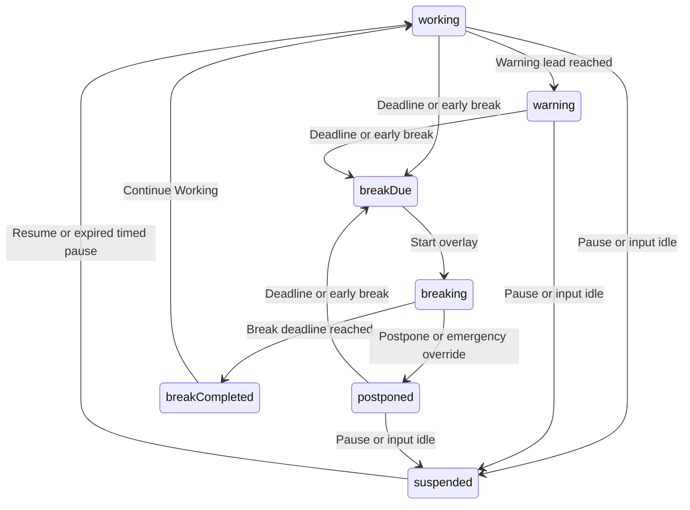

# BreakGuard Architecture

BreakGuard is a local macOS menu-bar app built with Swift Package Manager, AppKit, and SwiftUI. It has no third-party dependencies. The minimum supported OS is macOS 13; microphone activity detection requires macOS 14.2.

## Ownership

| Area | Responsibility |
| --- | --- |
| `Domain/StateMachine.swift` | Timer transitions, focus accounting, skip policy, call holds, and recovery |
| `Domain/AppSettings.swift` | Defaults, duration limits, pace calculations, and confirmation delays |
| `Domain/DailySkipUsage.swift` | Usage across cycles and the local-day budget |
| `Domain/BreakPressure.swift` | Schedule pressure, card presentation, and dismissal deadlines |
| `Application/AppState.swift` | Main-actor coordination, input-idle checks, published UI state, and effects |
| `Services/` | Notifications, login items, camera/microphone activity, session events, and sleep assertions |
| `Overlay/` | Break windows on every display, the reminder card, and hold controls |
| `MenuBar/` and `Settings/` | AppKit menu presentation and SwiftUI settings |
| `Persistence/PersistenceStore.swift` | Schema checks, JSON loading, and atomic replacement |

`BreakGuardApp` retains the app state and system monitors. AppKit owns lifecycle and windows; SwiftUI renders their contents. The app uses accessory activation and has no Dock icon.

## Timer and Effects

The machine stores absolute `Date` deadlines. The one-second UI timer samples the clock rather than decrementing a counter.

The diagram shows the main flow. Resume can also restore a warning or postponed countdown. Cancelling a manual break restores its captured countdown. Sleep, lock, and screen-saver events can start a break from any running countdown.

`AppState.tick()` checks monitoring gaps, reads a fresh device-activity snapshot, checks input idle, ticks the machine, publishes changed properties, reconciles windows and notifications, and saves changed data. One snapshot owns both idle detection and the hold. A separate `uiTick` event refreshes time-derived text even when the timer state is unchanged. The timer runs in common and modal-panel run-loop modes so a confirmation dialog does not stop it.

Actions are checked again in the machine when they execute. An expired deadline cannot gain a free manual cancellation, an elapsed break cannot be postponed, and a duplicate start cannot restart a break. `AppState` rejects queued break actions while the session is inactive or the app is terminating.

## Rest and Focus Accounting

Manual breaks capture the prior phase, remaining time, and request time in `ManualBreakOrigin`. Cancellation restores the countdown and excludes overlay time from focused minutes. A completed break credits elapsed focus and starts a fresh cycle. Postponements and the emergency override exclude time already spent resting before continuing the same cycle.

Sleep, lock, and screen saver are verified absence. Input silence alone is weaker evidence: after ten minutes it suspends a running countdown, backdated to the last input, without declaring a completed break. Active camera use and selected microphone use prevent a call from being treated as input idle.

`SessionActivity` keeps a set of inactive reasons. A wake event cannot reactivate the app while the screen is still locked. During inactivity, ticks stop, windows hide, and sleep assertions release. Break deadlines remain absolute, so time asleep counts as rest. Recovery normally shows the remaining break or its completion screen. A long verified absence can close the old cycle automatically using the same gap rule that resets tapering.

The tapering accumulator uses actual focus rather than cycle count. Shared helpers restore countdowns and record completed breaks or cycle violations, keeping manual, automatic, and recovery paths consistent.

## Skips, Calls, and Reminders

Harder mode permits one regular skip per cycle within a shared daily budget. An extension and a postponement each spend one use. `DailySkipUsage` survives new cycles and statistics resets; normal-mode uses are also counted. The weekly emergency timestamp remains separate from that budget.

Camera and selected microphone activity share one transient call-hold flag. A hold pushes running deadlines forward to preserve the warning lead or two minutes, whichever is longer. Held time counts as focus. A device becoming active does not dismiss an imposed break. Warning notifications are cancelled during an engaged hold and rearmed when it ends.

Schedule pressure uses a single nonactivating reminder card. Dismissal requires a three-second hold and hides the card for sixty seconds. There is no screen veil. `PressureReminderState` clears a dismissal when the pressure episode ends or its reason changes. The card is suppressed during calls, pauses, real breaks, and the emergency grant; a completed break inside the scheduled window satisfies that window.

## System Boundaries

Device activity is read inside the one-second application tick through `CallActivityClient`. Each read enumerates current IDs; there are no separate monitor timers, retained device lists, or queued activity callbacks. Camera detection requires a live, running CoreMediaIO device with input streams. Selected microphone detection requires CoreAudio process input IO, a current input device, and an active input stream. Aggregate devices must include an active input subdevice; playback taps alone are excluded. Native adapters validate returned data sizes. A missing device or failed read supplies no activity evidence, rather than retaining a previous true flag. Inactivity clears transient hold state, and wake reads it again. The menu names the observed camera or microphone instead of claiming that a call is in progress. No media is captured and no capture permission is requested. Screen sharing alone has no detector.

Break and completion windows hold idle-display and idle-system sleep assertions. Assertions use bounded timeouts and uptime-based renewal. Replacement assertions are created before old ones are released; a failed renewal keeps existing coverage and retries. Manual sleep and lid closure remain system-controlled.

Notification scheduling uses a client adapter, generation tokens, and a recursive lock to order submission and cancellation. Late callbacks cannot remove a newer warning or submit a cancelled one. The cached schedule includes warning time, break deadline, and sound preference.

Persistence accepts schema 3 and supplies defaults for missing optional fields within that schema. Other schemas and invalid files fall back to defaults. Changed snapshots replace the state file atomically; unchanged snapshots do not write. Runtime carries both skip quotas, minute-coarse heartbeat stamps, and enough information to recover without counting unmonitored time as focus.

See [the technical reference](TECHNICAL_REFERENCE.md) for constants and validation, and [the user guide](docs/USER_GUIDE.md) for controls and limitations.
