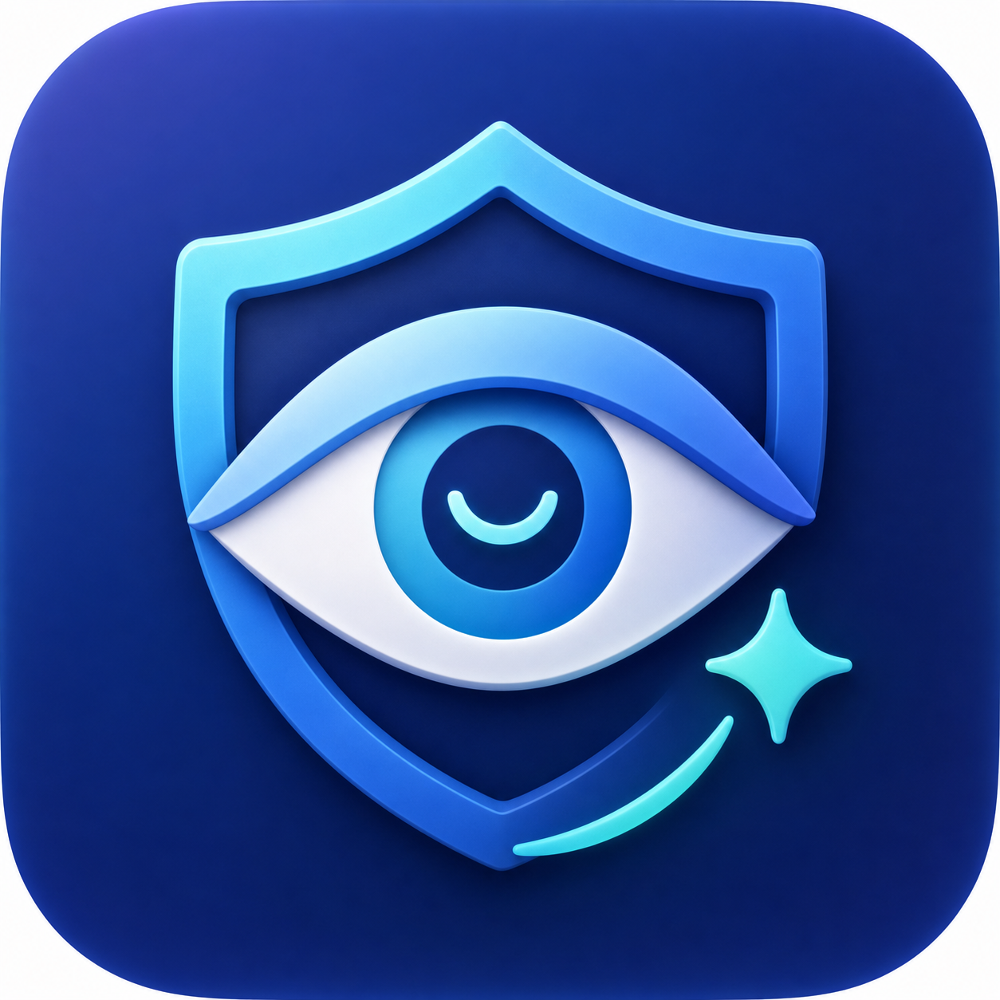
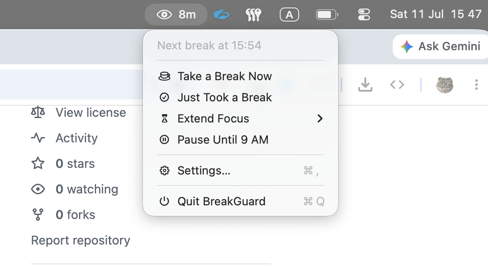

# BreakGuard

<p align="center">
  
</p>

<p align="center">
  A native macOS menu-bar app that makes sure you actually rest your eyes.
</p>

BreakGuard counts down focus time, warns before a break, and shows a full-screen break overlay when
it is time to look away. Everything stays on your Mac: there are no accounts, servers, analytics, or
network requests.



## Quick Start

On a new Mac, clone, validate, build, install, and launch BreakGuard with one Terminal command:

```bash
git clone --depth 1 https://github.com/mbogdan0/eyes-care.git "$HOME/BreakGuard" && "$HOME/BreakGuard/scripts/setup.sh"
```

The source is saved under `~/BreakGuard`, and the runnable app is installed at
`~/Applications/BreakGuard.app`. On first launch, approve notification permission if you want warning
banners; all timer and overlay features work without it.

## Highlights

- Configurable focus and break intervals
- Full-screen break overlays on every connected display
- Early breaks, planned focus extensions, and controlled postponements
- Pause until 9 AM for the rest of the day, surviving sleep and relaunch
- Honesty-first confirmations for every action that skips or silences rest
- Optional focus tags, streaks, history, and focused-minute statistics
- Sleep and inactivity detection that avoids counting time away as work
- Local notifications with capability-aware Time Sensitive delivery
- Local-only, schema-versioned persistence

## Requirements

- macOS 13 or newer
- Apple Command Line Tools or Xcode
- Git when cloning the repository

A paid Apple Developer account is not required.

## Install from an Existing Checkout

From the project root, check the development environment once:

```bash
./scripts/bootstrap.sh
```

Then build, install, and launch BreakGuard:

```bash
./scripts/install.sh
```

The app is installed at `~/Applications/BreakGuard.app` and appears in the menu bar as an eye with a timer.

### Rebuild and restart

After changing the code, rebuild, replace the installed app, and restart it with the same single command:

```bash
./scripts/install.sh
```

The script resolves the repository and home-directory paths automatically. It does not depend on a
specific username or checkout location, and compatible settings and statistics are preserved.

## Basic Usage

1. Work while the menu-bar timer counts down.
2. Receive an optional warning shortly before the break.
3. When time expires, rest while BreakGuard covers the screens with a countdown.
4. Complete the break, optionally classify the focus interval, and start a new cycle.

Use **Take a Break Now** for an early break, **Just Took a Break** for rest the app did not observe,
**Extend Focus** when a break must be delayed in advance, and **Pause Until 9 AM** when you are done
for the day — reminders stay silent until the next morning and **Resume Now** ends the pause early.
Extending, pausing, marking an unobserved break, and quitting each ask for confirmation. Settings
control timing, focus tags, notifications, launch at login, and statistics.

## Commands

| Command | Purpose |
| --- | --- |
| `swift test` | Run all unit tests. |
| `./scripts/build.sh` | Build and sign `build/BreakGuard.app` without installing it. |
| `./scripts/setup.sh` | Validate the environment, then build, install, and launch the app. |
| `./scripts/install.sh` | Build, install, restart, and verify that the app stays running. |
| `./scripts/verify.sh` | Test, build, install, launch, and check for an immediate crash. |
| `./scripts/run.sh` | Open the installed app. |
| `./scripts/stop.sh` | Stop the app. |
| `./scripts/uninstall.sh` | Remove the app while preserving its data. |
| `./scripts/uninstall.sh --delete-data` | Remove the app and all persisted data. |

## Documentation

- [User guide](docs/USER_GUIDE.md) — behavior, settings, notifications, persistence, troubleshooting,
  and macOS limitations
- [Architecture](ARCHITECTURE.md) — state machine, persistence model, UI boundaries, and notification
  implementation

## License

Copyright © 2026 [**Bohdan Melnichenko**](https://github.com/mbogdan0).

BreakGuard is source-available under the [BreakGuard Personal Non-Commercial License](LICENSE).
Individuals may use, copy, modify, and share it for personal purposes without profit. Business,
organizational, paid, monetized, and other commercial use requires prior written permission.
