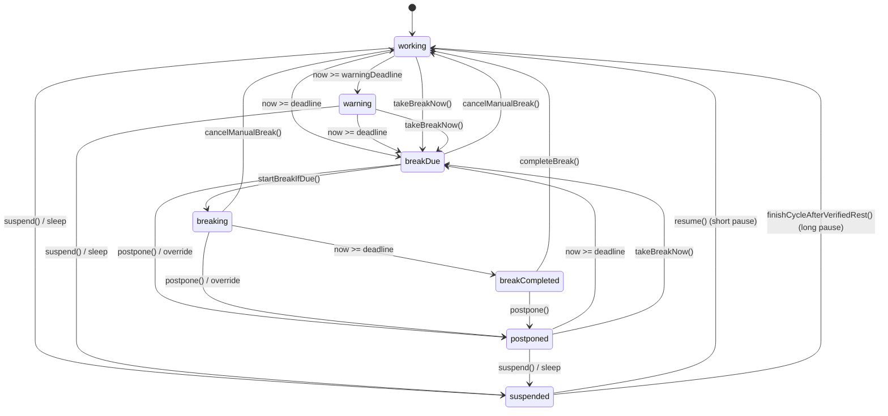

# BreakGuard — Technical Reference

Behavioral reference for auditing. Every value here is transcribed from source, not from
`README.md`, `ARCHITECTURE.md`, or `docs/USER_GUIDE.md` — those were cross-checked while
writing this and four of their statements are stale (see [§12](#12-findings)).

Scope: what happens, when, with what delay, under what condition. Layout cosmetics (fonts,
colors, paddings) are omitted except where they gate behavior. Line references are to the
state of the tree at the time of writing and drift with edits.

---

## 1. Overview

| Property | Value | Source |
|---|---|---|
| Language | Swift 5.9, no third-party dependencies | `Package.swift:1` |
| Build system | Swift Package Manager | `Package.swift` |
| Minimum OS | macOS 13.0 | `Package.swift:7`, `scripts/build.sh:47` |
| UI stack | AppKit + SwiftUI hybrid | — |
| Activation policy | `.accessory` — no Dock icon, menu bar only | `Application/BreakGuardApp.swift:20` |
| Bundle id | `local.bohdan.BreakGuard` | `scripts/build.sh:33` |
| Version | `1.2` (build `5`) | `scripts/build.sh:43,45` |
| Code signing | ad-hoc (`codesign --sign -`) | `scripts/build.sh:62` |
| Total Swift lines | 6 912 (sources + tests) | — |
| Entry point | `@main static func main()` | `Application/BreakGuardApp.swift:12` |
| Launch order | `AppState` → `MenuBarController` → `SleepWakeManager` → `appState.start()` | `Application/BreakGuardApp.swift:24` |

**Timing authority.** The state machine stores **absolute `Date` deadlines** and never
decrements a counter. Everything else re-reads the clock. There is exactly one timer in the
app: a 1 s repeating `Timer` on `RunLoop.main` in `.common` mode
(`Application/AppState.swift:338-341`). Each tick runs, in order: expired-timed-pause check →
`machine.tick()` → `publish()` → `reconcileStateEffects()` → `save()`
(`Application/AppState.swift:344-356`).

`publish()` is deliberately **not** equality-gated — the break-completion count-up depends on
it firing every second even when nothing changed (`Application/AppState.swift:172-178`).

---

## 2. Settings — defaults, ranges, readers

All 15 persisted settings. Defaults at `Domain/AppSettings.swift:89-107`, ranges at
`Domain/AppSettings.swift:62-69`.

| Key | Type | Default | Range | Primary reader |
|---|---|---|---|---|
| `workInterval` | s | **1800** (30 min) | 30 … 14400 s (30 s … 4 h) | `AppSettings.swift:112` |
| `focusPace` | enum | `.normal` | `moreBreaks` / `normal` / `deepFocus` / `tapering` | `AppSettings.swift:113,121` |
| `breakDuration` | s | **120** (2 min) | 30 … 3600 s (30 s … 60 min) | `StateMachine.swift:139` |
| `warningLeadTime` | s | **60** (1 min) | 0 … 1800 s (0 = off … 30 min) | `StateMachine.swift:117` |
| `firstPostponeDuration` | s | **120** (2 min) | 30 … 7200 s (30 s … 2 h) | `OverlayScreenManager.swift:192` |
| `secondPostponeDuration` | s | **900** (15 min) | 30 … 7200 s | `OverlayScreenManager.swift:193` |
| `taperingResetGap` | s | **21600** (6 h) | 3600 … 86400 s (1 … 24 h) | `StateMachine.swift:170` |
| `harderToSkipBreaks` | Bool | **false** | — | `StateMachine.swift:55,59,63` |
| `notificationSound` | Bool | **true** | — | `NotificationManager.swift:229` |
| `launchAtLogin` | Bool | **true** | — | `AppState.swift:427` |
| `showSecondsInMenuBar` | Bool | **true** | — | `MenuPresentation.swift:73` |
| `coarseSecondsInMenuBar` | Bool | **false** | — | `MenuPresentation.swift:77` |
| `workingHoursEnabled` | Bool | **false** | — | `WorkingHours.swift:27` |
| `weekdayWorkingHours` | struct | `enabled: true`, 09:00–18:00 | see below | `WorkingHours.swift:30` |
| `weekendWorkingHours` | struct | `enabled: false`, 09:00–18:00 | see below | `WorkingHours.swift:29` |

### 2.1 `clamp()` — order matters

`Domain/AppSettings.swift:137-148`. Runs in both `StateMachine` inits (`:11`, `:39`), in
`startWorkCycle()` (`:165`), and in `AppState.updateSettings` (`AppState.swift:284`).

1. Each duration bounded to its own range (`:138-142`).
2. **Then** `warningLeadTime = min(warningLeadTime, workInterval)` (`:143`) — a second,
   tighter bound applied after the first.
3. Working-hours ranges clamped (`:144-145`).
4. `taperingResetGap` bounded to `3600 … 86400` s (`:146-147`).

`clampSeconds` (`:190-194`) rejects NaN first (→ lower bound), bounds **before** the `Int`
conversion so an oversized `Double` cannot trap, then rounds to whole seconds.

### 2.2 Working hours

`Domain/WorkingHours.swift`. Same-day ranges only; overnight spans are not supported.

| Property | Value | Source |
|---|---|---|
| Storage | minutes from local midnight | `:8-9` |
| Default start / end | 540 (09:00) / 1080 (18:00) | `:8-9` |
| Minimum span | 5 min | `:11` |
| Start clamp | 0 … 1434 (= 1440 − 1 − 5) | `:14` |
| End clamp | (start + 5) … 1439 | `:15` |
| Membership | `[start, end)` — start inclusive, end exclusive | `:19` |
| Weekend detection | `Calendar.isDateInWeekend` (locale-aware) | `WeeklyFocusSummary.swift:11` |

Effect when outside hours: menu bar renders in the caution pill — but only if the state's own
emphasis is `.none`, so a red warning is never diluted to yellow
(`MenuPresentation.swift:144`).

### 2.3 Settings field entry

`mm:ss` parsing, `Domain/Formatting.swift:82-98`:

| Input | Result |
|---|---|
| `30` (bare integer) | 30 **minutes** = 1800 s (`:87-88`) |
| `0:30` | 30 seconds (`:90-94`) |
| `2:75` | rejected — seconds must be 0…59 (`:92`) |
| `1:005` | rejected — seconds component max 2 chars (`:91`) |
| anything else | rejected (`:96`) |

Steppers move by **60 s** (`GeneralSettingsView.swift:194`); the text field is for exact
values. The tapering-reset stepper moves by **1 hour** (`GeneralSettingsView.swift:127`).

---

## 3. State machine

Seven states, `Domain/TimerState.swift:3-11`.

| State | Payload | Meaning |
|---|---|---|
| `.working` | `deadline`, `warningDeadline` | Normal countdown |
| `.warning` | `deadline` | Inside the warning lead window |
| `.breakDue` | — | Deadline passed, break not yet started |
| `.breaking` | `deadline`, `startedAt`, `duration` | Break countdown, overlay visible |
| `.breakCompleted` | — | Countdown hit zero; overlay counts rest **upward** |
| `.postponed` | `deadline` | Break deferred (postpone or emergency override) |
| `.suspended` | `previous`, `remaining`, `until?` | `until == nil` → sleep/lock; `until != nil` → timed pause |



### 3.1 Automatic transitions — `tick()`

`Domain/StateMachine.swift:112-136`. Evaluated once per second.

| From | Condition | To | Line |
|---|---|---|---|
| `.working` | `now >= deadline` | `.breakDue` | `:115-116` |
| `.working` | `warningLeadTime > 0 && now >= warningDeadline` | `.warning` | `:117-118` |
| `.warning` | `now >= deadline` | `.breakDue` | `:121-122` |
| `.postponed` | `now >= deadline` | `.breakDue` | `:125-126` |
| `.breaking` | `now >= deadline` | `.breakCompleted` | `:129-130` |
| `.breakDue`, `.breakCompleted`, `.suspended` | — | no automatic exit | `:132-133` |

Deadline checks are `>=`, so a transition fires on the exact second.

An expired **timed pause** is resolved one level up, in `AppState.tick()` before
`machine.tick()` runs: `.suspended(_,_,until)` with `now >= until` calls `machine.resume()`
(`Application/AppState.swift:346-348`).

### 3.2 Explicit transitions

| Method | Allowed from | Guard | Effect |
|---|---|---|---|
| `startBreak()` `:138` | `.breakDue` (enforced by caller `AppState.swift:181`) | — | captures focus + `breakStartedAt`, → `.breaking` |
| `completeBreak()` `:149` | `.breakCompleted` **only** | `== .breakCompleted` | credits focus, `completedBreaks += 1`, streak, → new cycle |
| `postpone(by:)` `:226` | `.breakDue`, `.breaking`, `.breakCompleted` | `canPostpone` | violation, counters, clears manual origin + capture, → `.postponed` |
| `takeBreakNow()` `:258` | `.working`, `.warning`, `.postponed` | — | records `ManualBreakOrigin`, → `.breakDue` |
| `cancelManualBreak()` `:290` | `.breaking`, `.breakDue` | `manualBreakOrigin != nil` | shifts `cycleStartDate`, restores interrupted state |
| `extendFocus(by:)` `:313` | `.working`, `.warning`, `.postponed` | `canExtendFocus` | shifts deadlines, sets `focusExtended` |
| `useEmergencyOverride()` `:88` | `.breaking`, `.breakDue` | `canUseEmergencyOverride` | violation, spends both allowances, → `.postponed(+90 min)` |
| `markBreakTaken()` `:338` | `.working`, `.warning`, `.postponed` | — | new cycle, records **nothing** |
| `suspend(until:)` `:347` | `.working`, `.warning`, `.postponed` | — | → `.suspended`, stamps `preservedAt` |
| `resume()` `:368` | `.suspended` **only** | — | long pause → new cycle; else restore |

Every disallowed source state is a **silent no-op**, not an error.

### 3.3 Side-effect reconciliation

`Application/AppState.swift:386-412`, runs after every publish.

| State | Overlay | Notification |
|---|---|---|
| `.working` | hide all | schedule warning at `warningDeadline` |
| `.warning` | hide all | — (already scheduled) |
| `.breakDue` | — | cancel; then `startBreakIfDue()` |
| `.breaking` / `.breakCompleted` | show on all screens + bring to front + activate app | cancel |
| `.postponed` | hide all | cancel |
| `.suspended` | hide all | cancel |

Because this runs on every tick, the break row re-enters the overlay path once a second
for the whole break. Each step there is therefore conditional (`Overlay/OverlayScreenManager.swift`):
the frame is re-set only when the screen actually moved, a window is ordered front only
when it is not visible, exactly one window is re-keyed and only when none of them holds
key status, and the app is re-activated only when it is not already active. Only
`orderFrontRegardless()` in `bringToFront()` stays unconditional — it is what keeps the
overlay above anything else at `.screenSaver` level, and it triggers no redraw.
Dropping any of those guards costs frames in the hold-to-confirm fill animation, which is
the one thing on the overlay animating between ticks.

`emergencyDisclosureExpanded` is force-collapsed on any non-break state
(`AppState.swift:378-383`). Notification permission is re-polled on every tick **only** while
the settings window is visible — it is an XPC round-trip (`AppState.swift:409-411`).

---

## 4. Interval math

Three formulas, chained. All in `Domain/AppSettings.swift`.

### 4.1 Pace multiplier — `:112-114`

```
effectiveWorkInterval = workInterval × paceMultiplier
```

| Pace | Multiplier | Interval at default 1800 s |
|---|---|---|
| `.moreBreaks` | 0.8 | 1440 s (24 min) |
| `.normal` | 1.0 | 1800 s (30 min) |
| `.tapering` | 1.0 (before penalty) | 1800 s (30 min) |
| `.deepFocus` | 1.2 | 2160 s (36 min) |

### 4.2 Tapering penalty — `:120-125`, `:55-57`

```
penalty  = clamp(taperedFocusSeconds, 0, 864000) / 60 × 1.0     seconds
interval = max( min(base, 600), base − penalty )
```

Worked, base 1800 s: after 2 h of accumulated focus (120 min) → penalty 120 s → 1680 s
(28 min). After 8 h (480 min) → penalty 480 s → 1320 s (22 min). After 20 h (1200 min) →
penalty 1200 s → 600 s, the floor.

### 4.3 Warning lead — `:133-135`

```
effectiveWarningLeadTime(interval) = max(0, min(warningLeadTime, interval / 2))
```

The warning can never claim more than the **back half** of the actual window. `clamp()` can
only bound the setting against the raw `workInterval`, but the interval a cycle runs may be
shorter (scaled pace, or tapered).

| `warningLeadTime` | interval | effective lead |
|---|---|---|
| 60 s | 1800 s | 60 s |
| 1800 s | 1800 s | 900 s |
| 1800 s | 600 s | 300 s |
| 1800 s | 0 s | 0 s |

A new cycle is built as `deadline = now + interval`,
`warningDeadline = now + (interval − effectiveLead)` (`StateMachine.swift:180-187`).

The three paths that re-anchor a deadline mid-cycle — `cancelManualBreak()`, `resume()`, and
`extendFocus()` from `.warning` — read the same cap through the private
`currentWarningLeadTime` (`StateMachine.swift:514-518`). The interval a cycle actually runs is
not stored, so that helper reconstructs it as
`effectiveWorkInterval(taperedFocus: runtime.taperedFocusSeconds)` — the same basis
`creditedFocusMinutes()` falls back to. `runtime.taperedFocusSeconds` is written only by
`startWorkCycle()`, so within a cycle it is exactly the value the cycle was built from.

---

## 5. Controls and their timings

### 5.1 Menu bar menu

`MenuBar/MenuBarController.swift:61-107`. Order: status row (disabled) · separator ·
Take a Break Now · Extend Focus ▸ · Pause Until 9 AM · Resume Now · separator · Settings… ·
separator · Quit.

| Control | Confirmation | Delay / hold | Hidden or disabled when |
|---|---|---|---|
| **Take a Break Now** | none | **instant** | hidden unless state ∈ {`.working`, `.warning`, `.postponed`} (`:159`) |
| **Extend Focus ▸ By 15 Minutes** | **none** | instant, +900 s | greyed when `!canExtendFocus` (`:41-46`) |
| **Extend Focus ▸ By 35 Minutes** | **NSAlert** | +2100 s | same |
| **Extend Focus ▸ By 45 Minutes** | **NSAlert** | +2700 s | same |
| **Extend Focus ▸ By 1 Hour 5 Minutes** | **NSAlert** | +3900 s | same |
| **Pause Until 9 AM** | **NSAlert** | instant | hidden unless `primaryAction == .takeBreak` (`:163`) |
| **Resume Now** | none | instant | hidden unless state is `.suspended` (`:164`) |
| **Settings…** | none | ⌘, | — |
| **Quit BreakGuard** | **NSAlert** | ⌘Q | — |

Only the **15-minute** extension skips confirmation (`:271-285`). All alerts put the
confirm button first and **Cancel** second, so the safe choice is the default
(`:249-258`).

Each extend option's title is rebuilt on every presentation update with the resulting end
time appended in grey: `deadline + minutes × 60` (`:332-351`). Falls back to a plain title
when the state has no deadline (`:353-360`).

### 5.2 Break overlay

One `NSPanel` per connected screen (`Overlay/OverlayScreenManager.swift:26-38`), keyed by
`NSScreenNumber` (`:75-78`), at `.screenSaver` window level (`:122`), re-laid out on
`didChangeScreenParameters` (`:14-19`). **Escape is overridden to do nothing** (`:131-133`).
The break prompt is drawn once from a 10-string catalog and cached so all screens match
(`:24-25`, `:81-98`).

| Control | Hold | Shown when |
|---|---|---|
| **Postpone for \<first\>** | see 5.3 | scheduled break **and** `canPostpone` |
| **Postpone for \<second\>** | see 5.3 | same |
| **Cancel Break** | **none — plain button, instant** | manual break only (`isManualBreak`) |
| **Emergency override** disclosure row | none, `0.15 s` animation | any scheduled break (even during cooldown) |
| **Skip This Break — +1h 30m** | **1 s** | `canUseEmergencyOverride` |
| **Continue Working** | none; bound to **Return** | `.breakCompleted` |

Three mutually exclusive action sets (`:333-339`): `.cancel` (manual break — no postpone
buttons, **no override section**), `.postpone`, `.unavailable` (text only: "Postponement was
already used this cycle").

### 5.3 Hold-to-confirm matrix

`Overlay/HoldToConfirmButton.swift:60-74`. "Shorter" / "longer" is decided by comparing the
two configured postpone durations **against each other**, not by field order — either
setting may be the longer one. A tie counts as shorter (the test is `duration > other`).

| Tier | Shorter postponement | Longer postponement | Active when |
|---|---|---|---|
| `.standard` | **1 s** | **3 s** | normal mode, `cycleRegularPostponements == 0` |
| `.harder` | **3 s** | **6 s** | `harderToSkipBreaks == true` |
| `.repeated` | **3 s** | **9 s** | normal mode, `cycleRegularPostponements > 0` |

Tier selection: `StateMachine.swift:62-65`.

Note that `.harder` is only reachable for a cycle's **first** postponement — harder mode
blocks `canPostpone` afterwards. So 6 s is the practical maximum in harder mode, while
normal mode reaches 9 s via `.repeated`.

**Gesture mechanics** (`:37-49`):

| Property | Value |
|---|---|
| Gesture | `onLongPressGesture(minimumDuration: holdDuration, maximumDistance: 30)` |
| Pointer drift that cancels the hold | **30 pt** |
| Fill animation | `.linear(duration: holdDuration)` |
| Drain on early release | `.easeOut(duration: 0.15)` |
| Assistive-tech path | `.accessibilityRepresentation { Button(...) }` — **no hold** (`:51-53`) |

### 5.4 Menu bar rendering

`MenuBar/MenuPresentation.swift:62-151`.

| State | Title | Status row |
|---|---|---|
| `.working` | countdown | `Next break at <h:mm a>` |
| `.warning` | countdown | `Break starts in <countdown>` |
| `.postponed` | `+<countdown>` | `Postponed break at <h:mm a>` |
| `.breaking` | `BREAK <countdown>` | `Break remaining <countdown>` |
| `.breakDue` | `BREAK` | `Break due now` |
| `.breakCompleted` | `DONE` | `Break completed` |
| `.suspended(until:)` | `PAUSED` | `Paused until <h:mm a>` |
| `.suspended(nil)` | `PAUSED` | `Paused with <countdown> remaining` |

Emphasis (`:10-19`, `:99`, `:107`, `:118`, `:144`):

| Emphasis | Trigger | Precedence |
|---|---|---|
| `.urgent` (red) | `.warning`; `.postponed` with `warningLeadTime > 0 && remaining <= warningLeadTime` | always wins |
| `.caution` (amber) | `focusExtended` while working; any other `.postponed`; outside working hours | applied only if emphasis is `.none` |
| `.none` | everything else | — |

Countdown granularity (`:72-88`):

| Mode | Rendering |
|---|---|
| `showSeconds`, normal | `mm:ss`, or `hh:mm:ss` past an hour (`Formatting.swift:12`) |
| `showSeconds` + `coarseSeconds` | `ceil(interval / 10) × 10` — string changes once per **10 s**, never understates |
| seconds off | `ceil(interval / 60)` → `"<n>m"` / `"<h>h <m>m"` / `"<h>h"` |

### 5.5 Keyboard

There are **no global hotkeys** — no `RegisterEventHotKey`, no `NSEvent` monitors.

| Key | Scope | Action |
|---|---|---|
| ⌘, | status menu only | Settings… (`MenuBarController.swift:103`) |
| ⌘Q | status menu only | Quit, with confirmation (`:106`) |
| Return | break completion overlay | Continue Working (`OverlayScreenManager.swift:308`) |
| Escape | break overlay | **explicit no-op** (`OverlayScreenManager.swift:131-133`) |

Because the app is `LSUIElement` with no main menu, ⌘, and ⌘Q are only live while the status
menu is open.

### 5.6 Settings window

560 × 640 pt initial, min 540 × 560, reused across opens, `isReleasedWhenClosed = false`
(`AppState.swift:266-278`). Five tabs (`Settings/SettingsView.swift`): General, Schedule,
System, Statistics, About.

| Action | Scope | Confirmation |
|---|---|---|
| **Restore Defaults…** (General ▸ Advanced) | all 15 settings, all tabs | `.confirmationDialog`, destructive role (`GeneralSettingsView.swift:70`, `:93-99`) |
| **Reset Statistics…** (Statistics) | statistics only | `.confirmationDialog`, destructive role (`StatisticsSettingsView.swift:47-54`) |
| **Send Test Notification** (System) | one notification | none; disabled unless `canSendTest` (`SystemSettingsView.swift:26`) |

Neither reset touches `emergencyOverrideUsedAt` — it lives in `RuntimeState`, which neither
action replaces (§6.4).

---

## 6. Skip / postpone / override policy

### 6.1 The gates

`Domain/StateMachine.swift:49-65`, verbatim:

```swift
normalSkipUsed = cyclePostponements > 0 || focusExtended
canExtendFocus = !harderToSkipBreaks || !normalSkipUsed
canPostpone    = !harderToSkipBreaks || !normalSkipUsed
```

| Mode | Postponements per cycle | Extensions per cycle |
|---|---|---|
| **Normal** (`harderToSkipBreaks == false`) | **unlimited** | **unlimited** |
| **Harder** (`harderToSkipBreaks == true`) | **one skip action total** — either one postponement *or* one extension, not one of each |

In normal mode there is no quota and no block. The only escalation is the hold duration
(§5.3).

The gates read live settings, so toggling `harderToSkipBreaks` mid-cycle re-evaluates the
current cycle immediately in both directions. `updateSettings` republishes
`canPostpone` / `postponeHoldTier` / `canExtendFocus` synchronously rather than waiting for
the next tick (`AppState.swift:288-292`).

### 6.2 Per-cycle counters

`Domain/PersistedAppData.swift:13-40`. All four reset **only** via `startWorkCycle()`
(`StateMachine.swift:188-191`), which is reached from `completeBreak()`, `markBreakTaken()`,
`finishCycleAfterVerifiedRest()`, and crash recovery.

| Counter | Incremented by | Purpose |
|---|---|---|
| `cyclePostponements` | `postpone()` `:239` **and** `useEmergencyOverride()` `:95` | feeds `normalSkipUsed` |
| `cycleRegularPostponements` | `postpone()` only `:240` | feeds the hold tier — so Extend Focus and the override do **not** escalate holds |
| `focusExtended` | `extendFocus()` `:333` **and** `useEmergencyOverride()` `:96` | feeds `normalSkipUsed`; drives the amber pill |
| `cycleViolated` | first `postpone()` `:234` or first `useEmergencyOverride()` `:90` | one violation per cycle maximum |

### 6.3 Postponement

Two configurable durations shown **simultaneously** as two options (not a first/second
sequence): `firstPostponeDuration` (default 120 s) and `secondPostponeDuration`
(default 900 s). The new deadline is anchored to **now**, not to the original break deadline
(`StateMachine.swift:252`).

Allowed only from `.breakDue`, `.breaking`, `.breakCompleted` (`:227-233`) — **not** from
`.postponed`, so a postponement cannot be chained directly; it must expire to `.breakDue`
first.

State cleared by `postpone()`:

| Field | Line | Why |
|---|---|---|
| `manualBreakOrigin` → nil | `:244` | postponing a manual break opts into the standard contract and forfeits the free `cancelManualBreak()` exit |
| `cycleFocusDuration` → nil | `:250` | see §8.4 — a stale capture silently understates focus |
| `breakStartedAt` → nil | `:251` | same |

Preserved: `cycleStartDate`, `taperedFocusSeconds`, `emergencyOverrideUsedAt`, all counters.

Statistics: first postponement of a cycle sets `cycleViolated`, zeroes `currentCleanStreak`,
`violatedCycles += 1` (`:234-238`); every postponement does `totalPostponements += 1`
(`:241`). **Postponed time counts as focus.**

A postponement **never re-notifies** — `reconcileStateEffects` cancels the warning on
`.postponed` (`AppState.swift:400-402`). The menu bar still turns red for the same lead
window (`MenuPresentation.swift:118`).

### 6.4 Emergency override

`Domain/AppSettings.swift:74-80`, `Domain/StateMachine.swift:70-101`.

| Constant | Value |
|---|---|
| `focusGrant` | **5400 s (90 min)** |
| `cooldown` | **604 800 s (rolling 7 days from last use)** |
| `holdDuration` | **1 s** |

Rolling, not calendar — explicitly so it cannot be spent twice across a weekend (`:67-69`).
Boundary is inclusive: locked at `cooldown − 1 s`, available at exactly `cooldown`.

Availability requires **all three** (`:76-81`):

1. `manualBreakOrigin == nil` — a manual break already has the free `cancelManualBreak()` exit.
2. State ∈ {`.breaking`, `.breakDue`} — not `.breakCompleted`, not `.postponed`, not a countdown.
3. `now >= emergencyOverrideUsedAt + 604800`, or never used.

Effect (`:88-101`):

- → `.postponed(now + 5400 s)`
- records a violation **once per cycle** (override + postpone in the same cycle = one violated cycle)
- zeroes `currentCleanStreak`
- does **not** increment `totalPostponements`
- spends **both** allowances (`cyclePostponements += 1` *and* `focusExtended = true`), so a
  90-minute grant cannot stack a further extension on top

The row is shown during cooldown too, reading "Already used this week. Available again on
\<date time\>." (`OverlayScreenManager.swift:265-271`) — deliberate, per the comment at
`:218-219`.

`emergencyOverrideUsedAt` lives in `RuntimeState`, **not** in `AppSettings` or `Statistics`,
precisely because "Restore Defaults" and "Reset Statistics" replace those wholesale and would
refill the quota (`PersistedAppData.swift:36-39`). `startWorkCycle()` carries it explicitly
through its rebuild (`StateMachine.swift:199-200`).

---

## 7. Tapering

### 7.1 Constants

| Constant | Value | Source |
|---|---|---|
| Rate | **1 s off the next window per accumulated focus minute** | `AppSettings.swift:34` |
| Floor | **600 s (10 min)**, non-configurable | `AppSettings.swift:39` |
| Accumulator ceiling | **864 000 s (240 h)** | `AppSettings.swift:46` |
| Reset gap | **21 600 s (6 h)** default, 1–24 h configurable | `AppSettings.swift:104` |

The ceiling is derived, not literal: `TimeInterval(SettingsRange.workInterval.upperBound) * 60`.
Changing the work-interval upper bound silently moves it.

**The inner `min(base, 600)`** exists so the floor cannot *lengthen* an already-short
interval: with a 5-minute base, the window stays 5 minutes and never grows to 10
(`AppSettings.swift:118-119`).

**The sanitizer** (`:50-53`) rejects NaN via the `> 0` guard — every comparison against NaN
is false, so it falls to the zero branch. `-inf` → 0; `+inf` and `1e300` → 864 000. This is
not cosmetic: the accumulator is persisted as a JSON number, `JSONEncoder` throws on
infinity/NaN, and `PersistenceStore.save()` only **logs** that throw
(`PersistenceStore.swift:55-57`) — a poisoned value would silently freeze every future write.

### 7.2 Accumulation

`StateMachine.startWorkCycle()` `:164-180`:

```swift
if now − closedCycleFocus().end >= taperingResetGap {
    tapered = 0
} else {
    tapered = sanitize( sanitize(banked) + sanitize(earned) )
}
```

Triple sanitization — both terms individually, then the sum.

**The accumulator runs under all four paces.** Only the *penalty application* is gated on
`focusPace == .tapering` (`AppSettings.swift:121`). Consequence: switching to Tapering
mid-afternoon inherits the whole day's accumulated total rather than starting from a fresh
full window.

### 7.3 What counts as focus

Measured by the single private `closedCycleFocus()` (`StateMachine.swift:213-224`), shared by
both the tapering charge and the statistics credit, so the two can never disagree.

| Time | Charged? | Mechanism |
|---|---|---|
| Ordinary working time | **yes** | — |
| Postponed-window time | **yes** | deliberate |
| Honor-system "Just Took a Break" cycle | **yes** to tapering, **no** to statistics | `markBreakTaken()` `:338` |
| Cancelled manual break — overlay time | **no** | `cancelManualBreak` shifts `cycleStartDate` `:293-294` |
| Sleep / lock / screen-saver time | **no** | `preservedAt` used as the end |
| Paused (suspended) time | **no** | `resume()` shifts `cycleStartDate` `:378-381` |
| Break time itself | **no** | capture frozen at `startBreak()` `:140` |

Backward clock jumps cannot produce a negative charge (which would *lengthen* the window):
`max(0, …)` inside `closedCycleFocus()` (`:218`, `:222`) plus the `> 0` sanitizer guard.

### 7.4 Reset

`taperedFocusSeconds` returns to 0 when `now − closed.end >= taperingResetGap`
(`StateMachine.swift:170-171`).

The Advanced settings status line reads `−<penalty> · resets <h:mm a> if you stop`, computed
as `now + taperingResetGap` — while focus is running there is no gap yet, so this is the
honest always-computable answer (`GeneralSettingsView.swift:144-149`). Reads "None yet" while
the penalty is under 1 s.

---

## 8. Sleep, wake, pause, crash

### 8.1 There is no idle detection

No HID-level idle detection exists — no `IOHIDGetParameter`, no `CGEventSource`, no idle
timers. "Idle" is inferred **entirely** from system notifications.

`Services/SleepWakeManager.swift:9-27` — eight observers routed to two handlers:

| Notification | Center | Handler |
|---|---|---|
| `willSleepNotification` | workspace | sleep/inactive |
| `didWakeNotification` | workspace | wake/active |
| `sessionDidResignActiveNotification` | workspace | sleep/inactive |
| `sessionDidBecomeActiveNotification` | workspace | wake/active |
| `com.apple.screenIsLocked` | distributed | sleep/inactive |
| `com.apple.screenIsUnlocked` | distributed | wake/active |
| `com.apple.screensaver.didstart` | distributed | sleep/inactive |
| `com.apple.screensaver.didstop` | distributed | wake/active |
| `didChangeScreenParametersNotification` | workspace | `startBreakIfDue()` (`:37`) |

Screen lock does not imply system sleep, hence its own observers. The screen saver may run
before the lock engages, or without any lock; `preserveForSleep()` / `restoreAfterSleep()`
are idempotent, so the double fire is harmless (`:20-25`).

`AppState.stop()` also calls `preserveForSleep()` on clean quit (`AppState.swift:143`).

### 8.2 The one threshold

**`>= settings.breakDuration`** (default **120 s**). Downtime at least this long counts as a
break actually taken. Applied at three sites:

| Site | Condition | Line |
|---|---|---|
| `resume()` | `now − preservedAt >= breakDuration` | `:372-376` |
| `restoreAfterSleep()` | same | `:427-431` |
| `restoreAfterSleep()` crash recovery | `preservedAt == nil && now − deadline >= breakDuration` | `:450-460` |

This is the **only** downtime threshold in the app, and it moves with the user's configured
break duration.

### 8.3 Restore precedence

`restoreAfterSleep()` `:414-466`, evaluated strictly in this order:

1. **Timed pause** (`:418-422`) — if `until` is set: while `now < until`, return untouched
   (the pause outlives sleep *and* relaunch); once passed, `finishCycleAfterVerifiedRest()`.
2. **Long-pause rule** (`:427-431`) — the `>= breakDuration` test above.
3. **Per-state** (`:433-465`):
   - `.breaking` → deadline re-anchored to `now + preservedRemaining`, stamps cleared
   - `.suspended` → `resume()`
   - `.working` / `.warning` / `.postponed` → crash recovery: sets `preservedAt = deadline`
     first (so `startWorkCycle()` can compute the reset gap from the stale deadline), then
     starts a fresh cycle. Per the comment at `:453-457`, this charges tapering the whole
     nominal interval even if the machine died seconds into the cycle — a deliberate
     over-estimate the reset gap clears.
   - `.breakDue` / `.breakCompleted` → keep state, drop both stamps

`finishCycleAfterVerifiedRest()` (`:476-496`): when the downtime caught the user in
`.breaking` / `.breakDue` / `.breakCompleted`, **the break itself counts as completed** —
`completedBreaks += 1`, streak advanced or zeroed. From `.suspended` or a countdown state, no
break is recorded. Focus is credited to **`closed.end`'s calendar day**, not today's, so an
expired overnight pause credits the day the focus actually happened (`:491-494`).

### 8.4 Break capture

`cycleFocusDuration` and `breakStartedAt` are written by `startBreak()` (`:140-141`) and
describe **the break in progress**. Every exit from a break clears them:

| Exit | Line |
|---|---|
| `completeBreak()` → `startWorkCycle()` rebuild | `:195-196` |
| `cancelManualBreak()` | `:296-297` |
| `postpone()` | `:250-251` |

A stale capture fails **silently by understating focus**, not by crashing — it reports only
the work done before the break and drops everything after it. `closedCycleFocus()` still
switches on the state rather than reading the fields unconditionally, keeping the guarantee
structural (`:208-212`).

`creditedFocusMinutes()` (`:508-512`) deliberately does **not** use `closedCycleFocus()`: on
the `completeBreak()` path a missing `cycleFocusDuration` means a pre-capture file was
restored mid-break, and measuring from `cycleStartDate` would count the break itself as
focus. Its fallback is the nominal `effectiveWorkInterval(taperedFocus:)`.

### 8.5 Timed pause

**Pause Until 9 AM** → `Calendar.nextDate(matching: DateComponents(hour: 9, minute: 0),
matchingPolicy: .nextTime)` — today's 09:00 if not yet passed, otherwise tomorrow's
(`AppState.swift:242-248`). Behind an `NSAlert` confirmation.

`suspend(until:)` records `previous`, `remaining = max(1, deadline − now)`, `preservedAt`,
`preservedRemaining` (`:347-366`). The 1 s tick auto-resumes it once expired
(`AppState.swift:346-348`).

---

## 9. Notifications

`Services/NotificationManager.swift`. There is exactly one scheduled notification type.

| Property | Value | Line |
|---|---|---|
| Identifier | `breakguard.warning` | `:102` |
| Fires at | `warningDeadline` = deadline − effective lead (default **60 s** before) | `AppState.swift:390` |
| Trigger type | `UNCalendarNotificationTrigger`, second granularity, non-repeating | `:155-163` |
| Suppressed when | `warningLeadTime == 0` **or** the date is not in the future | `:145` |
| De-duplication | re-schedule within **< 1 s** of the pending date is skipped | `:252-254` |
| Body | "Save your work and finish the current task." | `:228` |
| Sound | `.default` iff `notificationSound == true` | `:229-231` |
| Foreground presentation | always `[.banner, .sound]` | `:241` |
| Interruption level | `.timeSensitive` iff the system reports the capability, else `.active` | `:153` |
| Authorization | requested once at launch, only if `.notDetermined`, options `[.alert, .sound]` | `:127-138` |

Title thresholds (`:214-220`):

| Lead time | Title |
|---|---|
| 0 s | `Break starting now` |
| 1–59 s | `Break in N seconds` |
| exactly 60 s | `Break in 1 minute` |
| ≥ 60 s | `Break in N minutes` (rounded) |

Test notification (`:273-299`):

| Step | Timing |
|---|---|
| Trigger | `UNTimeIntervalNotificationTrigger(timeInterval: 1)` — **1 s** |
| Delivery confirmation | queried **3 s** after queueing (`:295`) |
| Interruption level | forced to `.active` (`:285`) |

Cancelled on `.breakDue`, `.breaking`, `.breakCompleted`, `.postponed`, `.suspended`, on
sleep/inactive, and on `stop()`.

---

## 10. Statistics

`Domain/Statistics.swift:3-34`. **Nothing resets on a schedule** — there is no daily or weekly
rollover. `resetStatistics()` (`AppState.swift:300-304`) is the only reset.

| Field | Written by | Reset by |
|---|---|---|
| `currentCleanStreak` | +1 at `:159`, `:485` when `!cycleViolated`; → 0 at `:156`, `:236`, `:92`, `:483` | reset only |
| `bestCleanStreak` | `max(best, current)` at `:159`, `:486` | reset only |
| `completedBreaks` | +1 at `:153` (`completeBreak`), `:480` (verified rest) | reset only |
| `violatedCycles` | +1 once per cycle at `:237`, `:93` | reset only |
| `totalPostponements` | +1 per `postpone()` `:241` — **not** by the override | reset only |
| `lastCompletedBreakDate` | `:154`, `:481` | reset only |
| `focusMinutesByDay` | `creditFocus()` `:499` | pruned to 28 days |
| `totalFocusMinutes` | `creditFocus()` `:500` | lifetime — never pruned |

Actions that record **nothing**: `extendFocus`, `takeBreakNow`, `cancelManualBreak`,
`markBreakTaken`.

**Focus credit rounding** — `max(0, Int((duration / 60).rounded()))`, half-up to the whole
minute, in both call sites (`:491`, `:511`).

**Day key** — `"%04d-%02d-%02d"` from local-calendar components (`FocusDay.swift:6-9`).
Zero-padded so keys sort lexicographically in date order.

**Retention** — 28 days (`Statistics.swift:20`). Cutoff is `startOfDay(now) − 27 days`, today
inclusive; the filter is an exact string comparison thanks to the padding (`:25-33`). Runs
after every `creditFocus` and once on restore — **after** `restoreAfterSleep()`, so focus
credited during restoration lands before old days drop (`StateMachine.swift:44-46`).

**Weekly summary** — `Domain/WeeklyFocusSummary.swift:47-81`. Last **7** days, today first.
Each day compared against the mean of all *other* recorded days in the same category
(weekday / weekend):

```
delta% = ((minutes − average) / average × 100).rounded()
```

Reports `.noHistory` when `minutes == 0` or the baseline holds fewer than
**`minimumBaselineDays = 2`** days (`:29`, `:66`). Days absent from history are omitted from
the baseline entirely rather than counted as zero, so untracked days never drag an average
down (`:63`). Baseline scope is bounded by the 28-day retention window.

---

## 11. Persistence

| Property | Value | Source |
|---|---|---|
| Path | `~/Library/Application Support/BreakGuard/state.json` | `PersistenceStore.swift:11-14` |
| Format | JSON, ISO-8601 dates, pretty-printed, sorted keys | `:63-67` |
| Schema version | **3** — a mismatch discards the whole file | `PersistedAppData.swift:86`, `PersistenceStore.swift:29-32` |
| Write strategy | encode → `.tmp` (atomic) → `replaceItemAt` / `moveItem` | `:46-53` |
| Write dedupe | skipped entirely when the payload equals `lastSaved` | `:44` |
| Failure handling | **logged only**, never surfaced | `:56` |
| Written on | `start()`, `stop()`, every 1 s tick, every publish | `AppState.swift:137,147,355,361` |

Backing store is a single JSON file — no `UserDefaults`, no `@AppStorage`, no database.

**Lenient decoding.** Both `AppSettings` (`AppSettings.swift:165-183`) and `RuntimeState`
(`PersistedAppData.swift:55-82`) use custom `init(from:)` with `decodeIfPresent ?? default`
for every field added after schema 3 shipped, so older files load instead of being discarded.
`Statistics` seeds a missing `totalFocusMinutes` from the sum of `focusMinutesByDay` — the one
moment the complete lifetime sum is still available (`Statistics.swift:57-58`).

**Legacy counter disambiguation** (`PersistedAppData.swift:73-81`): older builds counted an
emergency override inside `cyclePostponements`. On decode,
`cycleRegularPostponements = max(0, legacySkipCount − (overrideUsedInCurrentCycle ? 1 : 0))`,
inferred once for an in-progress legacy cycle.

---

## 12. Findings

Items where behavior and documentation, or behavior and apparent intent, do not line up. Each
is stated with what the code actually does. **§12.3 and §12.4 have been fixed** and are kept
here as a record; the rest are open.

### 12.1 Four stale statements in the existing docs

Commit `8c47028` changed harder mode from "one extension, then costlier postponements" to
"one skip action, then blocked". Three statements still describe the old policy:

| Location | Claim | Actual |
|---|---|---|
| `ARCHITECTURE.md:17` | "reports `postponePenalized`, which doubles the hold the overlay's postpone buttons require" | `postponePenalized` **no longer exists**. It was replaced by `canPostpone` + `postponeHoldTier`; harder mode now **blocks** the second skip rather than making it costlier. |
| `docs/USER_GUIDE.md:39` | "after it is spent, every further postponement demands a doubled hold" | Further postponements are **blocked outright** in harder mode. Also, `.harder` is 3 s / 6 s against `.standard` 1 s / 3 s — doubled for the longer button, **tripled** for the shorter. |
| `docs/USER_GUIDE.md:35` | "only one extension is allowed per cycle" | One extension **or** one postponement, whichever comes first — the two share a single allowance. |
| `docs/USER_GUIDE.md:47` | "Settings contains four tabs" | There are **five**: General, Schedule, System, Statistics, About (`Settings/SettingsView.swift`). |

### 12.2 Assistive tech bypasses every hold-to-confirm timer

`Overlay/HoldToConfirmButton.swift:51-53` exposes the control as a plain `Button` via
`.accessibilityRepresentation`. VoiceOver and Switch Control therefore activate **postpone**
and the **emergency override** with **zero hold time** — the 1/3/6/9 s friction values in
§5.3 do not apply on that path. The weekly override quota still applies; the deliberation
delay does not.

### 12.3 Asymmetric confirmation on the destructive settings actions — **fixed**

**Was:** **Restore Defaults** reset all 15 settings across all tabs with no dialog, while
**Reset Statistics** — narrower in scope — required one. The wider-reaching action was the
unguarded one.

**Now:** `Restore Defaults…` carries a destructive role and a `.confirmationDialog`
(`GeneralSettingsView.swift:70`, `:93-99`), matching the pattern already used by
`StatisticsSettingsView`. The dialog names what is reset and what is not.

### 12.4 Warning re-arm used the raw lead, not the effective lead — **fixed**

**Was:** three paths re-armed the warning deadline with `settings.warningLeadTime` directly —
`cancelManualBreak()`, `resume()`, and `extendFocus()` from `.warning` — while cycle
construction used `effectiveWarningLeadTime(for:)`, which caps the lead at half the window.

When `warningLeadTime > effectiveWorkInterval / 2`, resuming from a short pause, cancelling a
manual break, or extending during the warning landed in `.warning` earlier than the cycle's
own rule allowed. In the worst case the re-armed warning deadline fell at or before the
current moment, so the next `tick()` dropped straight back into `.warning` and an **Extend
Focus read as a no-op**. Not reachable with defaults (60 s lead against 1800 s); reachable
with a large configured lead, a short interval, or a heavily tapered window.

**Now:** all three read the cap through the private `currentWarningLeadTime`
(`StateMachine.swift:514-518`); see §4.3 for how the cycle interval is reconstructed. The
`lead > 0` test replaced the raw `settings.warningLeadTime > 0` check at the two
`.working`/`.warning` restore sites — equivalent, since the effective lead is positive
whenever the setting is (the shortest possible window is 24 s, so the cap floors at 12 s).

Covered by `testResumingAShortPauseDoesNotArmTheWarningEarly`,
`testCancellingAManualBreakDoesNotArmTheWarningEarly`, and
`testExtendingDuringTheWarningLeavesTheWarningState`
(`Tests/BreakGuardTests/TaperingAndOverrideEdgeCaseTests.swift`). All three were confirmed to
fail against the pre-fix code — the extension test only does so when the extension is no
longer than the excess lead, which is why it uses a 30-minute window with a 30-minute lead
and the 15-minute menu option.

### 12.5 "Just Took a Break" is dead UI over live, tested code

The menu item is commented out in three places — declaration `MenuBarController.swift:15`,
`configureMenu()` `:73-76`, `updatePresentation()` `:160-161`. The `@objc justTookBreak()`
action (`:260-269`) is **not** commented out; it is live but unreachable.
`AppState.markBreakTaken()` and `StateMachine.markBreakTaken()` are live and test-covered.
This is documented as deliberate (`MenuBarController.swift:10-14`, `ARCHITECTURE.md:13`);
restoring the item is an uncomment.

Worth noting for audit: `markBreakTaken()` charges the closed cycle's focus to **tapering**
but credits **nothing** to statistics. Turning the item back on makes that asymmetry
user-visible.

### 12.6 The time-sensitive entitlement is never active in script-built bundles

`scripts/build.sh:58-61` deliberately omits
`com.apple.developer.usernotifications.time-sensitive` — it is a restricted entitlement and
launchd refuses to spawn an ad-hoc signed bundle carrying it. The code probes the system
capability and falls back to `.active` (`NotificationManager.swift:153`), so
`.timeSensitive` delivery never engages in a build produced by that script. Intentional and
documented in the script; noted here because the Settings pane can display
"Allowed · Time Sensitive", which reflects the *system* setting, not what this build actually
uses.

### 12.7 Derived constant with a non-obvious coupling

`FocusPace.taperingFocusCeiling = TimeInterval(SettingsRange.workInterval.upperBound) * 60`
(`AppSettings.swift:46`) evaluates to 864 000 s by reusing the work-interval **seconds** upper
bound as a **minute** count. Raising `SettingsRange.workInterval`'s upper bound silently moves
the tapering accumulator ceiling with it. The two quantities are unrelated in meaning.
