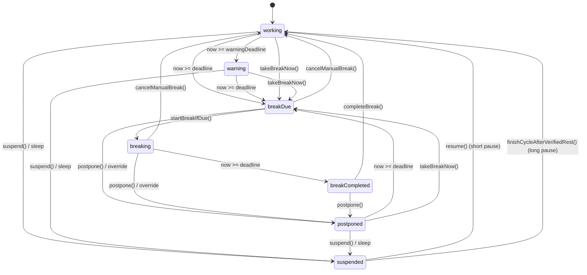

# BreakGuard — Technical Reference

Behavioral reference for auditing. Every value here is transcribed from source, not from
`README.md`, `ARCHITECTURE.md`, or `docs/USER_GUIDE.md` — those were cross-checked while
writing this and three of their statements are stale (see [§12](#12-findings)).

Scope: what happens, when, with what delay, under what condition. Layout cosmetics (fonts,
colors, paddings) are omitted except where they gate behavior. Line references are to the
state of the tree at the time of writing and drift with edits.

---

## 1. Overview

| Property | Value | Source |
|---|---|---|
| Language | Swift 5.9, no third-party dependencies | `Package.swift:1` |
| Build system | Swift Package Manager | `Package.swift` |
| Minimum OS | macOS 13.0 | `Package.swift:7`, `scripts/build.sh:47` |
| UI stack | AppKit + SwiftUI hybrid | — |
| Activation policy | `.accessory` — no Dock icon, menu bar only | `Application/BreakGuardApp.swift:20` |
| Bundle id | `local.bohdan.BreakGuard` | `scripts/build.sh:33` |
| Version | `1.2` (build `5`) | `scripts/build.sh:43,45` |
| Code signing | ad-hoc (`codesign --sign -`) | `scripts/build.sh:62` |
| Total Swift lines | 6 912 (sources + tests) | — |
| Entry point | `@main static func main()` | `Application/BreakGuardApp.swift:12` |
| Launch order | `AppState` → `MenuBarController` → `SleepWakeManager` → `appState.start()` | `Application/BreakGuardApp.swift:24` |

**Timing authority.** The state machine stores **absolute `Date` deadlines** and never
decrements a counter. Everything else re-reads the clock. There is exactly one timer in the
app: a 1 s repeating `Timer` on `RunLoop.main` in `.common` mode
(`Application/AppState.swift`). Each tick runs, in order: tick-gap heartbeat check →
idle-suspension update → camera-hold flag → `machine.tick()` (which stamps the persisted
minute-coarse heartbeat, applies the camera-hold clamp, and resolves an expired timed pause) →
`publish()` → `reconcileStateEffects()` → `save()` → `uiTick.send()`.

`publish()` **is** equality-gated per property via `setIfChanged`; time-derived displays
(menu bar countdown, break-completion count-up) refresh through the `uiTick` subject, which
fires every second regardless.

---

## 2. Settings — defaults, ranges, readers

All 16 persisted settings. Defaults at `Domain/AppSettings.swift:89-107`, ranges at
`Domain/AppSettings.swift:62-69`.

| Key | Type | Default | Range | Primary reader |
|---|---|---|---|---|
| `workInterval` | s | **1800** (30 min) | 30 … 14400 s (30 s … 4 h) | `AppSettings.swift:112` |
| `focusPace` | enum | `.normal` | `moreBreaks` / `normal` / `deepFocus` / `tapering` | `AppSettings.swift:113,121` |
| `breakDuration` | s | **120** (2 min) | 30 … 3600 s (30 s … 60 min) | `StateMachine.swift:139` |
| `warningLeadTime` | s | **60** (1 min) | 0 … 1800 s (0 = off … 30 min) | `StateMachine.swift:117` |
| `firstPostponeDuration` | s | **120** (2 min) | 30 … 7200 s (30 s … 2 h) | `OverlayScreenManager.swift:278` |
| `secondPostponeDuration` | s | **900** (15 min) | 30 … 7200 s | `OverlayScreenManager.swift:279` |
| `taperingResetGap` | s | **21600** (6 h) | 3600 … 86400 s (1 … 24 h) | `StateMachine.swift:170` |
| — | — | *(not a setting)* `FocusPace.taperingOvernightGap` = **10800** (3 h), the gap the day-boundary reset rule requires — see 7.4 | | `AppSettings.swift` |
| `harderToSkipBreaks` | Bool | **false** | — | `StateMachine.swift:55,59,63` |
| `notificationSound` | Bool | **true** | — | `NotificationManager.swift:229` |
| `launchAtLogin` | Bool | **true** | — | `AppState.swift:427` |
| `showSecondsInMenuBar` | Bool | **true** | — | `MenuPresentation.swift:73` |
| `coarseSecondsInMenuBar` | Bool | **false** | — | `MenuPresentation.swift:77` |
| `workingHoursEnabled` | Bool | **false** | — | `WorkingHours.swift:27` |
| `weekdayWorkingHours` | struct | `enabled: true`, 09:00–18:00 | see below | `WorkingHours.swift:30` |
| `weekendWorkingHours` | struct | `enabled: false`, 09:00–18:00 | see below | `WorkingHours.swift:29` |
| `scheduledBreak` | struct | `enabled: false`, 15:30–16:00 | same range rules; **weekdays only**, not configurable | `BreakPressure.swift` |

### 2.1 `clamp()` — order matters

`Domain/AppSettings.swift:137-148`. Runs in both `StateMachine` inits (`:11`, `:39`), in
`startWorkCycle()` (`:165`), and in `AppState.updateSettings` (`AppState.swift:284`).

1. Each duration bounded to its own range (`:138-142`).
2. **Then** `warningLeadTime = min(warningLeadTime, workInterval)` (`:143`) — a second,
   tighter bound applied after the first.
3. Working-hours ranges and the scheduled-break window clamped (`:144-146`).
4. `taperingResetGap` bounded to `3600 … 86400` s (`:146-147`).

`clampSeconds` (`:190-194`) rejects NaN first (→ lower bound), bounds **before** the `Int`
conversion so an oversized `Double` cannot trap, then rounds to whole seconds.

### 2.2 Working hours

`Domain/WorkingHours.swift`. Same-day ranges only; overnight spans are not supported.

| Property | Value | Source |
|---|---|---|
| Storage | minutes from local midnight | `:8-9` |
| Default start / end | 540 (09:00) / 1080 (18:00) | `:8-9` |
| Minimum span | 5 min | `:11` |
| Start clamp | 0 … 1434 (= 1440 − 1 − 5) | `:14` |
| End clamp | (start + 5) … 1439 | `:15` |
| Membership | `[start, end)` — start inclusive, end exclusive | `:19` |
| Weekend detection | `Calendar.isDateInWeekend` (locale-aware) | `WeeklyFocusSummary.swift:11` |

Effect when outside hours: menu bar renders in the caution pill — but only if the state's own
emphasis is `.none`, so a red warning is never diluted to yellow
(`MenuPresentation.swift:144`).

### 2.3 Settings field entry

`mm:ss` parsing, `Domain/Formatting.swift:82-98`:

| Input | Result |
|---|---|
| `30` (bare integer) | 30 **minutes** = 1800 s (`:87-88`) |
| `0:30` | 30 seconds (`:90-94`) |
| `2:75` | rejected — seconds must be 0…59 (`:92`) |
| `1:005` | rejected — seconds component max 2 chars (`:91`) |
| anything else | rejected (`:96`) |

Steppers move by **60 s** (`GeneralSettingsView.swift:213`); the text field is for exact
values. The tapering-reset stepper moves by **1 hour** (`GeneralSettingsView.swift:141`).

---

## 3. State machine

Seven states, `Domain/TimerState.swift:3-11`.

| State | Payload | Meaning |
|---|---|---|
| `.working` | `deadline`, `warningDeadline` | Normal countdown |
| `.warning` | `deadline` | Inside the warning lead window |
| `.breakDue` | — | Deadline passed, break not yet started |
| `.breaking` | `deadline`, `startedAt`, `duration` | Break countdown, overlay visible |
| `.breakCompleted` | — | Countdown hit zero; overlay counts rest **upward** |
| `.postponed` | `deadline` | Break deferred (postpone or emergency override) |
| `.suspended` | `previous`, `remaining`, `until?` | `until == nil` → sleep/lock; `until != nil` → timed pause |


```mermaid
stateDiagram-v2
    [*] --> working
    working --> warning: now >= warningDeadline
    working --> breakDue: now >= deadline
    warning --> breakDue: now >= deadline
    breakDue --> breaking: startBreakIfDue()
    breaking --> breakCompleted: now >= deadline
    breakCompleted --> working: completeBreak()
    breakDue --> postponed: postpone() / override
    breaking --> postponed: postpone() / override
    breakCompleted --> postponed: postpone()
    postponed --> breakDue: now >= deadline
    working --> breakDue: takeBreakNow()
    warning --> breakDue: takeBreakNow()
    postponed --> breakDue: takeBreakNow()
    breaking --> working: cancelManualBreak()
    breakDue --> working: cancelManualBreak()
    working --> suspended: suspend() / sleep
    warning --> suspended: suspend() / sleep
    postponed --> suspended: suspend() / sleep
    suspended --> working: resume() (short pause)
    suspended --> working: finishCycleAfterVerifiedRest() (long pause)
```

### 3.1 Automatic transitions — `tick()`

`Domain/StateMachine.swift:112-136`. Evaluated once per second.

| From | Condition | To | Line |
|---|---|---|---|
| `.working` | `now >= deadline` | `.breakDue` | `:115-116` |
| `.working` | `warningLeadTime > 0 && now >= warningDeadline` | `.warning` | `:117-118` |
| `.warning` | `now >= deadline` | `.breakDue` | `:121-122` |
| `.postponed` | `now >= deadline` | `.breakDue` | `:125-126` |
| `.breaking` | `now >= deadline` | `.breakCompleted` | `:129-130` |
| `.breakDue`, `.breakCompleted`, `.suspended` | — | no automatic exit | `:132-133` |

Deadline checks are `>=`, so a transition fires on the exact second.

An expired **timed pause** is resolved one level up, in `AppState.tick()` before
`machine.tick()` runs: `.suspended(_,_,until)` with `now >= until` calls `machine.resume()`
(`Application/AppState.swift:346-348`).

### 3.2 Explicit transitions

| Method | Allowed from | Guard | Effect |
|---|---|---|---|
| `startBreak()` `:138` | `.breakDue` (enforced by caller `AppState.swift:181`) | — | captures focus + `breakStartedAt`, → `.breaking` |
| `completeBreak()` `:149` | `.breakCompleted` **only** | `== .breakCompleted` | credits focus, `completedBreaks += 1`, streak, → new cycle |
| `postpone(by:)` `:226` | `.breakDue`, `.breaking`, `.breakCompleted` | `canPostpone` | violation, counters, clears manual origin + capture, → `.postponed` |
| `takeBreakNow()` `:258` | `.working`, `.warning`, `.postponed` | — | records `ManualBreakOrigin`, → `.breakDue` |
| `cancelManualBreak()` `:290` | `.breaking`, `.breakDue` | `manualBreakOrigin != nil` | shifts `cycleStartDate`, restores interrupted state |
| `extendFocus(by:)` `:313` | `.working`, `.warning`, `.postponed` | `canExtendFocus` | shifts deadlines, sets `focusExtended` |
| `useEmergencyOverride()` `:88` | `.breaking`, `.breakDue` | `canUseEmergencyOverride` | violation, spends both allowances, → `.postponed(+90 min)` |
| `markBreakTaken()` `:338` | `.working`, `.warning`, `.postponed` | — | new cycle, records **nothing** |
| `suspend(until:)` `:347` | `.working`, `.warning`, `.postponed` | — | → `.suspended`, stamps `preservedAt` |
| `resume()` `:368` | `.suspended` **only** | — | long pause → new cycle; else restore |

Every disallowed source state is a **silent no-op**, not an error.

### 3.3 Side-effect reconciliation

`Application/AppState.swift:386-412`, runs after every publish.

| State | Overlay | Notification |
|---|---|---|
| `.working` | hide all | schedule warning at `warningDeadline` |
| `.warning` | hide all | — (already scheduled) |
| `.breakDue` | — | cancel; then `startBreakIfDue()` |
| `.breaking` / `.breakCompleted` | show on all screens + bring to front + activate app | cancel |
| `.postponed` | hide all | cancel |
| `.suspended` | hide all | cancel |

Because this runs on every tick, the break row re-enters the overlay path once a second
for the whole break. Every step there is therefore conditional (`Overlay/OverlayScreenManager.swift`):
the frame is re-set only when the screen actually moved, a window is ordered front only
when it is not visible, exactly one window is re-keyed and only when none of them holds
key status, and the app is re-activated only when it is not already active.
`bringToFront()` reorders only a window that was actually displaced — level no longer
`.screenSaver`, or not visible — plus one unconditional re-assert every
`reassertInterval` ticks (10 s) to reclaim the front from anything else that parks itself
at `.screenSaver` without hiding us. It does not call `activateIfNeeded()`: its only
caller reaches it through `showOnAllScreens()`, which just did.

`orderFrontRegardless()` triggers no redraw, but it is a synchronous WindowServer round
trip on the main thread, to the same process compositing the full-screen surface — once
per window per second before this guard existed. Dropping any of these guards costs frames
in the hold-to-confirm fill, which is the one thing on the overlay animating between ticks
and can sweep for up to 9 s (`.repeated` tier).

`emergencyDisclosureExpanded` is force-collapsed on any non-break state
(`AppState.swift:378-383`). Notification permission is re-polled on every tick **only** while
the settings window is visible — it is an XPC round-trip (`AppState.swift:409-411`).

---

## 4. Interval math

Three formulas, chained. All in `Domain/AppSettings.swift`.

### 4.1 Pace multiplier — `:112-114`

```
effectiveWorkInterval = workInterval × paceMultiplier
```

| Pace | Multiplier | Interval at default 1800 s |
|---|---|---|
| `.moreBreaks` | 0.8 | 1440 s (24 min) |
| `.normal` | 1.0 | 1800 s (30 min) |
| `.tapering` | 1.0 (before penalty) | 1800 s (30 min) |
| `.deepFocus` | 1.2 | 2160 s (36 min) |

### 4.2 Tapering penalty — `:120-125`, `:55-57`

```
penalty  = min( clamp(taperedFocusSeconds, 0, 864000) / 60 × 1.2, 720 )   seconds
interval = max( min(base, 600), base − penalty )
```

Worked, base 1800 s: after 2 h of accumulated focus (120 min) → penalty 144 s → 1656 s
(27.6 min). After 8 h (480 min) → penalty 576 s → 1224 s (20.4 min). The penalty stops growing
at **720 s** after 600 focus minutes (10 h), so a 1800 s base bottoms out at **1080 s (18 min)**
however long the day runs.

**The 600 s floor and the 720 s cap are independent** and neither is redundant. The cap bounds
what is subtracted; the floor bounds what is left. With the cap in place the floor can only
bind when `base − 720 < 600`, i.e. a work interval under **1320 s (22 min)** — at the 1800 s
default it is unreachable.

### 4.3 Warning lead — `:133-135`

```
effectiveWarningLeadTime(interval) = max(0, min(warningLeadTime, interval / 2))
```

The warning can never claim more than the **back half** of the actual window. `clamp()` can
only bound the setting against the raw `workInterval`, but the interval a cycle runs may be
shorter (scaled pace, or tapered).

| `warningLeadTime` | interval | effective lead |
|---|---|---|
| 60 s | 1800 s | 60 s |
| 1800 s | 1800 s | 900 s |
| 1800 s | 600 s | 300 s |
| 1800 s | 0 s | 0 s |

A new cycle is built as `deadline = now + interval`,
`warningDeadline = now + (interval − effectiveLead)` (`StateMachine.swift:180-187`).

The three paths that re-anchor a deadline mid-cycle — `cancelManualBreak()`, `resume()`, and
`extendFocus()` from `.warning` — read the same cap through the private
`currentWarningLeadTime` (`StateMachine.swift:514-518`). The interval a cycle actually runs is
not stored, so that helper reconstructs it as
`effectiveWorkInterval(taperedFocus: runtime.taperedFocusSeconds)` — the same basis
`creditedFocusMinutes()` falls back to. `runtime.taperedFocusSeconds` is written only by
`startWorkCycle()`, so within a cycle it is exactly the value the cycle was built from.

---

## 5. Controls and their timings

### 5.1 Menu bar menu

`MenuBar/MenuBarController.swift:61-107`. Order: status row (disabled) · separator ·
Take a Break Now · Extend Focus ▸ · Pause Until 9 AM · Resume Now · separator · Settings… ·
separator · Quit.

| Control | Confirmation | Gate (harder / normal) | Hidden or disabled when |
|---|---|---|---|
| **Take a Break Now** | none | — | hidden unless state ∈ {`.working`, `.warning`, `.postponed`} (`:159`) |
| **Extend Focus ▸ By 15 Minutes** | **NSAlert** | **12 s / 6 s** | greyed when `!canExtendFocus` (`:41-46`) |
| **Extend Focus ▸ By 35 Minutes** | **NSAlert** | **30 s / 15 s** | same |
| **Extend Focus ▸ By 45 Minutes** | **NSAlert** | **30 s / 15 s** | same |
| **Extend Focus ▸ By 1 Hour 5 Minutes** | **NSAlert** | **30 s / 15 s** | same |
| **Pause Until 9 AM** | **NSAlert** | **180 s / 90 s** | hidden unless `primaryAction == .takeBreak` (`:163`) |
| **Resume Now** | none | — | hidden unless state is `.suspended` (`:164`) |
| **Settings…** | none | — | ⌘, |
| **Quit BreakGuard** | **NSAlert** | **180 s / 90 s** | ⌘Q |

No extension skips confirmation any more, in either mode. All alerts put the confirm button
first and **Cancel** second, so the safe choice is the default.

**The gate** (`SkipConfirmGate`, applied in `confirmHonestly(… gate:)`): the confirm button
starts disabled with the remaining count in parentheses — `Extend Anyway (30)`, or
`Quit Anyway (3:00)` once the count reaches a minute — and enables at zero. **Cancel stays
live throughout**; the gate is on the choice being reconsidered, never on backing out. A
disabled default button also ignores Return, which is the point. The countdown `Timer` is
added to `RunLoop.main` in **`.modalPanel`** mode explicitly: `NSAlert.runModal()` does not
run the default mode, so a `Timer.scheduledTimer` would never fire and the button would stay
disabled forever. It is invalidated in a `defer` after `runModal()` returns.

**One ladder, one scaling rule.** The constants below are the *harder-mode* counts; normal
mode pays exactly half via `SkipConfirmGate.scaled(_:harderToSkipBreaks:)`. Nothing is
waived — an hour of extra screen time costs the same hour whatever the mode says — so the
resolvers return a non-optional `TimeInterval` rather than `nil` for "ungated".

| Constant | Value (harder mode) |
|---|---|
| `SkipConfirmGate.extendShortSeconds` | **12** (extensions of ≤ 15 min) |
| `SkipConfirmGate.extendLongSeconds` | **30** |
| `SkipConfirmGate.extendShortThresholdMinutes` | **15**, inclusive |
| `SkipConfirmGate.pauseUntilMorningSeconds` | **180** |
| `SkipConfirmGate.quitAppSeconds` | **180** |
| `SkipConfirmGate.loosenSettingsSeconds` | **60** (never halved — see §5) |
| `SkipConfirmGate.disableHarderModeSeconds` | **90** (never halved; only reachable while harder mode is on) |

The two never-halved constants are the ones whose dialog only exists because harder mode was
on, so there is no normal-mode case to price. `MenuPresentationTests` asserts both the halving
rule and that the ladder rises monotonically, so reordering a rung has to be deliberate.

Each extend option's title is rebuilt on every **applied** presentation update with the
resulting end time appended in grey: `deadline + minutes × 60` (`:332-351`). Falls back to
a plain title when the state has no deadline (`:353-360`).

`updatePresentation()` is driven by `CombineLatest($timerState, $settings)` and so runs
**twice per tick** — `publish()` reassigns both unconditionally. Three guards keep that from
reaching AppKit:

- It uses the **emitted** values, not `appState.timerState`. `@Published` fires from
  `willSet`, so re-reading the property inside the sink returned the *previous* value and
  left the menu bar one tick behind on every transition.
- It returns early in `.breaking` / `.breakCompleted` unless `force` — the overlay covers
  the menu bar on every screen, so nothing rendered there is visible. `lastPresentation` is
  cleared on the way out so the first update after the break always applies.
- It compares against `lastPresentation` (`MenuPresentation` is `Equatable`) and returns
  early when nothing changed. With `coarseSecondsInMenuBar` on, the title only changes every
  10 s, so this drops most updates outside a break too.

`menuWillOpen` passes `force: true`: the menu is about to be read, so it must never show a
stale status line. Without these guards the `.caution` / `.urgent` path rasterised a fresh
`NSImage` — `NSBezierPath` fill, SF Symbol composite, `NSAttributedString.draw` — twice a
second behind the overlay, competing with the hold-to-confirm fill.

### 5.2 Break overlay

One `NSPanel` per connected screen (`Overlay/OverlayScreenManager.swift:26-38`), keyed by
`NSScreenNumber` (`:75-78`), at `.screenSaver` window level (`:122`), re-laid out on
`didChangeScreenParameters` (`:14-19`). **Escape is overridden to do nothing** (`:131-133`).
The break prompt is drawn once from a 10-string catalog and cached so all screens match
(`:24-25`, `:81-98`).

While any window is up, `DisplaySleepAssertion` (`Services/DisplaySleepAssertion.swift`) holds
an IOKit `kIOPMAssertionTypePreventUserIdleDisplaySleep` assertion — acquired at the top of
`showOnAllScreens()`, released at the top of `hideAll()` (unconditional, ahead of the
empty-window early-out, so a clean quit releases it too). The `.screenSaver` window *level*
only wins the stacking order; without the assertion the saver still starts and
`com.apple.screensaver.didstart` freezes the break (see 8.1). Display-idle only — lid close,
manual lock, and system sleep are untouched.

The assertion is **short and renewed**, not open-ended. `kIOPMAssertionTimeoutKey` is
`breakDuration + 5 min` (floored at 60 s) with `kIOPMAssertionTimeoutActionRelease`, and
`hold(timeout:)` re-creates it every half-ceiling off the per-second reconcile. A fixed
timeout does not work here: the completion screen has no upper bound of its own, so the
assertion expired under a live overlay and the display slept anyway — observed as
`TimedOut … 00:07:00` in `pmset -g log` with the overlay still on screen. Renewing keeps both
properties — never lapses while the overlay is up, never outlives a missed teardown by more
than the ceiling. A failed create clears the held marker so the next tick retries rather than
believing in an assertion it does not hold.

| Control | Hold | Shown when |
|---|---|---|
| **Postpone for \<first\>** | see 5.3, stated on the button as "Hold \<n\>s" | scheduled break **and** `canPostpone` |
| **Postpone for \<second\>** | see 5.3, stated on the button as "Hold \<n\>s" | same |
| **Cancel Break** | **none — plain button, instant** | manual break only (`isManualBreak`) |
| **Emergency override** disclosure row | none, `0.15 s` animation | any scheduled break (even during cooldown) |
| **Skip This Break — +1h 30m** | **1 s** | `canUseEmergencyOverride` |
| **Continue Working** | none; bound to **Return** | `.breakCompleted` |

Three mutually exclusive action sets (`:333-339`): `.cancel` (manual break — no postpone
buttons, **no override section**), `.postpone`, `.unavailable` (text only: "Postponement was
already used this cycle").

### 5.3 Hold-to-confirm matrix

`Overlay/HoldToConfirmButton.swift:76-90`. "Shorter" / "longer" is decided by comparing the
two configured postpone durations **against each other**, not by field order — either
setting may be the longer one. A tie counts as shorter (the test is `duration > other`).

| Tier | Shorter postponement | Longer postponement | Active when |
|---|---|---|---|
| `.standard` | **1 s** | **3 s** | normal mode, `cycleRegularPostponements == 0` |
| `.harder` | **3 s** | **9 s** | `harderToSkipBreaks == true` |
| `.repeated` | **3 s** | **9 s** | normal mode, `cycleRegularPostponements > 0` |

Tier selection: `StateMachine.swift:62-65`.

Note that `.harder` is only reachable for a cycle's **first** postponement — harder mode
blocks `canPostpone` afterwards. `.harder` and `.repeated` price identically (both mean the
cycle's cheap skip is gone), so 9 s is the maximum either way; harder mode simply charges it
on the first postponement instead of the second.

**Gesture mechanics** (`:37-49`):

| Property | Value |
|---|---|
| Gesture | `onLongPressGesture(minimumDuration: holdDuration, maximumDistance: 30)` |
| Pointer drift that cancels the hold | **30 pt** |
| Fill animation | `.linear(duration: holdDuration)` |
| Drain on early release | `.easeOut(duration: 0.15)` |
| Assistive-tech path | `.accessibilityRepresentation { Button(...) }` — **no hold** (`:51-53`) |

### 5.4 Menu bar rendering

`MenuBar/MenuPresentation.swift:62-151`.

| State | Title | Status row |
|---|---|---|
| `.working` | countdown | `Next break at <h:mm a>` |
| `.warning` | countdown | `Break starts in <countdown>` |
| `.postponed` | `+<countdown>` | `Postponed break at <h:mm a>` |
| `.breaking` | `BREAK <countdown>` | `Break remaining <countdown>` |
| `.breakDue` | `BREAK` | `Break due now` |
| `.breakCompleted` | `DONE` | `Break completed` |
| `.suspended(until:)` | `PAUSED` | `Paused until <h:mm a>` |
| `.suspended(nil)` | `PAUSED` | `Paused with <countdown> remaining` |

Emphasis (`:10-19`, `:99`, `:107`, `:118`, `:144`):

| Emphasis | Trigger | Precedence |
|---|---|---|
| `.urgent` (red) | `.warning`; `.postponed` with `warningLeadTime > 0 && remaining <= warningLeadTime` | always wins |
| `.caution` (amber) | `focusExtended` while working; any other `.postponed`; outside working hours | applied only if emphasis is `.none` |
| `.none` | everything else | — |

Countdown granularity (`:72-88`):

| Mode | Rendering |
|---|---|
| `showSeconds`, normal | `mm:ss`, or `hh:mm:ss` past an hour (`Formatting.swift:12`) |
| `showSeconds` + `coarseSeconds` | `ceil(interval / 10) × 10` — string changes once per **10 s**, never understates |
| seconds off | `ceil(interval / 60)` → `"<n>m"` / `"<h>h <m>m"` / `"<h>h"` |

### 5.5 Keyboard

There are **no global hotkeys** — no `RegisterEventHotKey`, no `NSEvent` monitors.

| Key | Scope | Action |
|---|---|---|
| ⌘, | status menu only | Settings… (`MenuBarController.swift:103`) |
| ⌘Q | status menu only | Quit, with confirmation (`:106`) |
| Return | break completion overlay | Continue Working (`OverlayScreenManager.swift:387-396`) |
| Escape | break overlay | **explicit no-op** (`OverlayScreenManager.swift:195-197`) |

Because the app is `LSUIElement` with no main menu, ⌘, and ⌘Q are only live while the status
menu is open.

### 5.6 Settings window

560 × 640 pt initial, min 540 × 560, reused across opens, `isReleasedWhenClosed = false`
(`AppState.swift:266-278`). Five tabs (`Settings/SettingsView.swift`): General, Schedule,
System, Statistics, About.

| Action | Scope | Confirmation |
|---|---|---|
| **Harder to skip breaks** toggle, **off** direction | one setting | `confirmHonestly` gated **90 s** (`AppState.setHarderToSkipBreaks`) |
| **Harder to skip breaks** toggle, **on** direction | one setting | none — friction belongs on the way out |
| **Reset Statistics…** (Statistics) | statistics only | `.confirmationDialog`, destructive role (`StatisticsSettingsView.swift:47-54`) — ungated, it removes no rest |

There is **no Restore Defaults**. It was removed with the gate unification: a single click
that reset every tab to values looser than most users configure is the cheapest possible way
past the per-visit loosening charge described in §5, and the charge was the only thing
standing behind it.

**A break falling due aborts any open confirmation** (`abortOpenConfirmation`, called from
`reconcileStateEffects` before the overlay is ordered front). The overlay sits at
`.screenSaver` and would otherwise cover the alert while the modal session went on swallowing
the clicks meant for the break — recoverable only with an Escape key nobody would think to
press. The app's 1 s tick keeps running during a modal session (`RunLoop.main` `.common`
covers `NSModalPanelRunLoopMode`), which is what makes this reachable at all — and what makes
the abort work.

`runModal()` returns `.abort`, which `confirmHonestly` reports as `HonestAnswer.aborted`
rather than folding into the confirm/decline pair. For four of the five callers the two are
the same branch — `quit`, `confirmExtension`, `pauseUntilMorning` and `setHarderToSkipBreaks`
all write nothing unless the answer is `.confirmed`. `confirmSettingsVisit` is the exception
and must tell them apart, because *its* declined branch is a write; see §"The settings-visit
gate".

`abortOpenConfirmation()` returns whether it actually aborted something, and the `.breakDue`
and `.breaking` branches bail out of the reconcile when it did. `abortModal()` only unwinds
the modal loop on its **next** pass, so ordering the overlay front in the same tick would put
it over a session that is still live — the very state being avoided. Waiting one tick costs a
second and makes the ordering real; the state is still `.breakDue` when the tick comes round.

`confirmHonestly` also refuses to nest: it returns `.aborted` immediately when a confirmation
is already open. `isConfirmationOpen` is one flag for the whole app, so a second alert's
`defer` would clear it while the first was still on screen, leaving that one invisible to
`abortOpenConfirmation()` and uncovered by the nudge-card suppression below.

With the top gates at **three minutes**, this is a routine path rather than a corner case: a
break can now comfortably fall due behind a Quit or Pause confirmation, and does. The
consequence is deliberate — a Quit waiting out its gate is interrupted by the very break it
was about to disable, and changes nothing.

For the same reason the **nudge card is suppressed while a confirmation is open**: it also
sits at `.screenSaver` and, unlike the veil, takes its clicks rather than passing them
through. The veil stays up — dimming an alert is harmless.

`setHarderToSkipBreaks` writes nothing on Cancel and calls `objectWillChange.send()` so the
toggle, which already drew itself in the off position, re-reads the unchanged value. The alert
is dispatched via `DispatchQueue.main.async` from the binding setter: `runModal()` spins a
nested run loop, and entering one from inside a SwiftUI binding setter re-enters the view
update still in progress.

#### The settings-visit gate

`AppState.showSettings` snapshots `settings` at the start of each **visit** (only when the
window is not already visible, so bringing an open window forward does not forgive the edits
made so far). A `NSWindow.willCloseNotification` observer on the single, reused settings window
calls `confirmSettingsVisit()`.

| Step | Behaviour |
|---|---|
| Trigger | settings window closing, and `isTerminating == false` — quitting never stops to argue |
| Applies when | `snapshot.harderToSkipBreaks \|\| settings.harderToSkipBreaks` |
| Charged on | `settings.weakensGuard(comparedTo: snapshot)` — the **net** difference, once per visit |
| Gate | **60 s** (`SkipConfirmGate.loosenSettingsSeconds`), never halved — the charge only exists when harder mode was on at one end of the visit |
| Cancel | the whole visit is reverted, `launchAtLogin` included — **except** `harderToSkipBreaks`, which keeps its live value |
| Abort | nothing is written; the snapshot is parked and the question is asked again |

The visit is keyed on the snapshot's existence, **not** on `window.isVisible`: a miniaturized
window reports `isVisible == false`, so testing that let a visit be re-baselined — loosen,
miniaturize, reopen, close, no charge.

**Cancel keeps the live `harderToSkipBreaks`** because that toggle is priced at its own 90 s
gate and is deliberately absent from `weakensGuard`. Writing it back from the snapshot made the
safe branch unsafe in both directions: switched **on** during the visit, Cancel turned it back
off — a loosening performed by the branch meant to prevent one; switched **off** during the
visit, Cancel reinstated it, discarding a decision already paid for separately.

**An abort is not a Cancel here.** This is the only confirmation whose declined branch is a
*write* — it discards a whole settings visit. A break falling due behind the 60 s gate aborts
the alert (see above), and treating that as Cancel would answer a question the user never saw.
Instead `settingsSnapshot` goes back and `settingsChargeDeferred` is set;
`retryDeferredSettingsCharge()`, called from `reconcileStateEffects`, asks again once the state
is `.working`/`.warning` with no confirmation open. Reopening the pane clears the flag — the
visit is live again, so the charge returns to being levied on close.

**Known limit, accepted:** the charge is levied on *close*, while edits apply live, so a pane
left open — or miniaturized indefinitely — is never charged. Quitting with the pane open skips
it too, via the `isTerminating` guard, though quitting costs 180 s so that route is not cheaper.

Edits still apply live as they are made. Gating each write instead would open a dialog per
stepper click (`secondsBinding` fires once per 60 s nudge, `timeOfDayBinding` once per
`DatePicker` component change), and would charge the same for tightening as for loosening,
which teaches the user to stay out of the pane entirely.

`weakensGuard` (`Domain/SettingsGuard.swift`) is pure and fully tested
(`Tests/BreakGuardTests/SettingsGuardTests.swift`), stated in both directions per field:

| Weakens | Tightens | Excluded |
|---|---|---|
| longer `workInterval`, shorter `breakDuration` | the reverse | `warningLeadTime` — the break still lands at the same moment |
| longer `firstPostponeDuration` / `secondPostponeDuration` | the reverse | `notificationSound` |
| looser `focusPace.guardRank` (`moreBreaks` 0 → `tapering` 1 → `normal` 2 → `deepFocus` 3) | stricter rank | `showSecondsInMenuBar`, `coarseSecondsInMenuBar` |
| shorter `taperingResetGap`, **while the pace is `.tapering`** | longer | the same gap under any other pace — it drives nothing there |
| `holdBreaksWhileOnCamera` off → on | on → off | |
| `launchAtLogin` on → off | | |
| an after-hours range `widens` | narrower range, or the feature switched on | |
| `scheduledBreak` off, or the range `narrows` | longer window | |

The after-hours row compares `afterHoursRange(_:)`, which reports a day range as disabled
whenever `workingHoursEnabled` is off, rather than comparing the raw ranges beside a separate
test on the switch. The raw comparison got the *direction* wrong: the defaults park an unused
9–18 weekday range behind a switch that ships off, so turning after-hours pressure **on** with
wider hours than that read as a loosening. Folding the switch in also subsumes its own row —
with the current side inert, `widens(from:)` reports whether the baseline had any pressure to
lose, and correctly says no when both day categories were off anyway.

`guardRank` exists because `workIntervalMultiplier` cannot express this: `.tapering` and
`.normal` share **1.0**, but tapering shortens every window as the day accumulates, so leaving
it is a loosening the multiplier alone cannot see.

**Restore Defaults used to be covered by this gate rather than exempt from it**, writing
`AppSettings.defaults` wholesale from inside an open settings window so the visit diff saw
every field it reset. The residual gap was narrow but real: if the user's settings happened to
be looser than the defaults in every compared field, the visit weakened nothing and
`harderToSkipBreaks = false` rode along uncharged. The button is gone, and with it the gap.
| **Send Test Notification** (System) | one notification | none; disabled unless `canSendTest` (`SystemSettingsView.swift:26`) |

Neither reset touches `emergencyOverrideUsedAt` — it lives in `RuntimeState`, which neither
action replaces (§6.4).

---

## 6. Skip / postpone / override policy

### 6.1 The gates

`Domain/StateMachine.swift:49-65`, verbatim:

```swift
normalSkipUsed = cyclePostponements > 0 || focusExtended
canExtendFocus = !harderToSkipBreaks || !normalSkipUsed
canPostpone    = !harderToSkipBreaks || !normalSkipUsed
```

| Mode | Postponements per cycle | Extensions per cycle |
|---|---|---|
| **Normal** (`harderToSkipBreaks == false`) | **unlimited** | **unlimited** |
| **Harder** (`harderToSkipBreaks == true`) | **one skip action total** — either one postponement *or* one extension, not one of each |

In normal mode there is no quota and no block. The only escalation is the hold duration
(§5.3).

The gates read live settings, so toggling `harderToSkipBreaks` mid-cycle re-evaluates the
current cycle immediately in both directions. `updateSettings` republishes
`canPostpone` / `postponeHoldTier` / `canExtendFocus` synchronously rather than waiting for
the next tick (`AppState.swift:288-292`).

### 6.2 Per-cycle counters

`Domain/PersistedAppData.swift:13-40`. All four reset **only** via `startWorkCycle()`
(`StateMachine.swift:188-191`), which is reached from `completeBreak()`, `markBreakTaken()`,
`finishCycleAfterVerifiedRest()`, and crash recovery.

| Counter | Incremented by | Purpose |
|---|---|---|
| `cyclePostponements` | `postpone()` `:239` **and** `useEmergencyOverride()` `:95` | feeds `normalSkipUsed` |
| `cycleRegularPostponements` | `postpone()` only `:240` | feeds the hold tier — so Extend Focus and the override do **not** escalate holds |
| `focusExtended` | `extendFocus()` `:333` **and** `useEmergencyOverride()` `:96` | feeds `normalSkipUsed`; drives the amber pill |
| `cycleViolated` | first `postpone()` `:234` or first `useEmergencyOverride()` `:90` | one violation per cycle maximum |

### 6.3 Postponement

Two configurable durations shown **simultaneously** as two options (not a first/second
sequence): `firstPostponeDuration` (default 120 s) and `secondPostponeDuration`
(default 900 s). The new deadline is anchored to **now**, not to the original break deadline
(`StateMachine.swift:252`).

Allowed only from `.breakDue`, `.breaking`, `.breakCompleted` (`:227-233`) — **not** from
`.postponed`, so a postponement cannot be chained directly; it must expire to `.breakDue`
first.

State cleared by `postpone()`:

| Field | Line | Why |
|---|---|---|
| `manualBreakOrigin` → nil | `:244` | postponing a manual break opts into the standard contract and forfeits the free `cancelManualBreak()` exit |
| `cycleFocusDuration` → nil | `:250` | see §8.4 — a stale capture silently understates focus |
| `breakStartedAt` → nil | `:251` | same |

Preserved: `cycleStartDate`, `taperedFocusSeconds`, `emergencyOverrideUsedAt`, all counters.

Statistics: first postponement of a cycle sets `cycleViolated`, zeroes `currentCleanStreak`,
`violatedCycles += 1` (`:234-238`); every postponement does `totalPostponements += 1`
(`:241`). **Postponed time counts as focus.**

A postponement **never re-notifies** — `reconcileStateEffects` cancels the warning on
`.postponed` (`AppState.swift:400-402`). The menu bar still turns red for the same lead
window (`MenuPresentation.swift:118`).

### 6.4 Emergency override

`Domain/AppSettings.swift:74-80`, `Domain/StateMachine.swift:70-101`.

| Constant | Value |
|---|---|
| `focusGrant` | **5400 s (90 min)** |
| `cooldown` | **604 800 s (rolling 7 days from last use)** |
| `holdDuration` | **3 s**, flat — the one friction value that does **not** double in harder mode |

Rolling, not calendar — explicitly so it cannot be spent twice across a weekend (`:67-69`).
Boundary is inclusive: locked at `cooldown − 1 s`, available at exactly `cooldown`.

Availability requires **all three** (`:76-81`):

1. `manualBreakOrigin == nil` — a manual break already has the free `cancelManualBreak()` exit.
2. State ∈ {`.breaking`, `.breakDue`} — not `.breakCompleted`, not `.postponed`, not a countdown.
3. `now >= emergencyOverrideUsedAt + 604800`, or never used.

Effect (`:88-101`):

- → `.postponed(now + 5400 s)`
- records a violation **once per cycle** (override + postpone in the same cycle = one violated cycle)
- zeroes `currentCleanStreak`
- does **not** increment `totalPostponements`
- spends **both** allowances (`cyclePostponements += 1` *and* `focusExtended = true`), so a
  90-minute grant cannot stack a further extension on top

The row is shown during cooldown too — a hatch nobody knows about is one nobody can plan
around — reading "Already used this week. Available again **in** 3 days 5 hours."
(`OverlayScreenManager.swift`, and the same sentence on the nudge card).

That is the **remaining wait**, not the date it lands on, via `formatTimeUntilPhrase`
(`Domain/Formatting.swift`): a timestamp three days out makes the reader do the subtraction
themselves. Two largest units only — days, hours, minutes — because nobody waiting three days
needs the seconds; a zero in second place is dropped (`3 days`, not `3 days 0 hours`), and
anything under a minute reads "less than a minute". Settings ▸ General shows the same fact
compactly as `Used · back in 3 days 5 hours`.

The strings are computed in view bodies against `Date()`, so they are correct whenever the
overlay or nudge is presented and refresh on any `AppState` publish. A settings pane left open
for hours can drift, which at days/hours granularity is invisible — no timer is warranted.
`DateFormatter.breakGuardDateTime` was retired with this change; `breakGuardTime` remains.

`emergencyOverrideUsedAt` lives in `RuntimeState`, **not** in `AppSettings` or `Statistics`,
precisely because "Reset Statistics" replaces the latter wholesale and would refill the quota
(`PersistedAppData.swift:36-39`). `startWorkCycle()` carries it explicitly through its rebuild
(`StateMachine.swift:199-200`).

### 6.5 Break pressure — dimming and the nudge card

`Domain/BreakPressure.swift`, `Overlay/NudgeWindowManager.swift`,
`AppState.reconcilePressure()`. Non-blocking by construction: the veil window sets
`ignoresMouseEvents = true`, so every click, drag, scroll, and keystroke reaches whatever is
underneath. Nothing here holds the display awake — that is a break's job.

**Master gate.** `pressureReason(at:)` returns `nil` unless `harderToSkipBreaks`. With the
switch off nothing below exists and Working Hours stays a menu bar color.

| Reason | Condition | Precedence |
|---|---|---|
| `.scheduledBreak` | `scheduledBreak.enabled`, day is a **weekday**, and `now` is in `[start, end)` | wins |
| `.outsideWorkingHours` | `isOutsideWorkingHours(at:)` — the same predicate the amber pill uses | only if the above did not apply |

| Constant | Value | Source |
|---|---|---|
| Veil opacity | **0.28** black, constant (no ramp) | `BreakPressure.veilOpacity` |
| Card return after dismissal | **120 s** | `BreakPressure.cardReturnInterval` |
| Veil / card window level | `.screenSaver`, re-asserted every **10 ticks** | `NudgeWindowManager` |

**Suppression** — `StateMachine.isPressureSuppressed(satisfiedWindow:)`, true on any of:

| Condition | Why |
|---|---|
| `.breakDue` / `.breaking` / `.breakCompleted` | the real overlay owns the screen |
| `.suspended` | timed pause, or an idle bracket on an unattended machine |
| `cameraHoldActive` | the app already refuses to interrupt a call |
| `isPressureOverrideActive` | `now < emergencyOverrideUsedAt + 5400 s` |
| `statistics.lastCompletedBreakDate ∈ [windowStart, windowEnd)` | a break taken inside the scheduled window satisfies it |

The last rule is passed a window **only** for `.scheduledBreak`; after hours no window is
passed, so a two-minute break settles nothing there.

**The override as a pressure hatch.** `spendOverrideOnPressure()` shares the one weekly quota
with `useEmergencyOverride()` and is deliberately asymmetric with it: it stamps
`emergencyOverrideUsedAt` and nothing else — no violation, no streak reset, no allowance spent,
no state change. Conversely, an override spent at a break overlay also silences the pressure
for its 5400 s grant, since both read the same stamp.

**Card actions.** One action either way: *Take a Break Now*, an ordinary break of
`breakDuration` via `takeBreakNow()`, plus the collapsed override disclosure. Stopping for the
day is deliberately **not** offered here — it lives in the status menu behind its own
40-second gate (§5.1). The card is a
`.nonactivatingPanel`, so pressing its buttons never steals key focus from the app being
typed in; `NudgeCardHostingView.acceptsFirstMouse` returns `true` so the first click lands on
the control rather than on activating the panel.

---

## 7. Tapering

### 7.1 Constants

| Constant | Value | Source |
|---|---|---|
| Rate | **1.2 s off the next window per accumulated focus minute** | `AppSettings.swift:34` |
| Penalty cap | **720 s (12 min)**, non-configurable — reached at 600 focus minutes (10 h) | `AppSettings.swift` |
| Floor | **600 s (10 min)**, non-configurable | `AppSettings.swift:39` |
| Accumulator ceiling | **864 000 s (240 h)** | `AppSettings.swift:46` |
| Reset gap | **21 600 s (6 h)** default, 1–24 h configurable | `AppSettings.swift:104` |

The ceiling is derived, not literal: `TimeInterval(SettingsRange.workInterval.upperBound) * 60`.
Changing the work-interval upper bound silently moves it.

**The inner `min(base, 600)`** exists so the floor cannot *lengthen* an already-short
interval: with a 5-minute base, the window stays 5 minutes and never grows to 10
(`AppSettings.swift:118-119`).

**The sanitizer** (`:50-53`) rejects NaN via the `> 0` guard — every comparison against NaN
is false, so it falls to the zero branch. `-inf` → 0; `+inf` and `1e300` → 864 000. This is
not cosmetic: the accumulator is persisted as a JSON number, `JSONEncoder` throws on
infinity/NaN, and `PersistenceStore.save()` only **logs** that throw
(`PersistenceStore.swift:55-57`) — a poisoned value would silently freeze every future write.

### 7.2 Accumulation

`StateMachine.startWorkCycle()` `:164-180`:

```swift
if taperingDayStartedOver(since: lastFocusAt ?? closedCycleFocus().end) {
    tapered = 0
} else {
    tapered = sanitize( sanitize(banked) + sanitize(earned) )
}
```

Triple sanitization — both terms individually, then the sum.

**The accumulator runs under all four paces.** Only the *penalty application* is gated on
`focusPace == .tapering` (`AppSettings.swift:121`). Consequence: switching to Tapering
mid-afternoon inherits the whole day's accumulated total rather than starting from a fresh
full window.

### 7.3 What counts as focus

Measured by the single private `closedCycleFocus()` (`StateMachine.swift:213-224`), shared by
both the tapering charge and the statistics credit, so the two can never disagree.

| Time | Charged? | Mechanism |
|---|---|---|
| Ordinary working time | **yes** | — |
| Postponed-window time | **yes** | deliberate |
| Honor-system "Just Took a Break" cycle | **yes** to tapering, **no** to statistics | `markBreakTaken()` `:338` |
| Cancelled manual break — overlay time | **no** | `cancelManualBreak` shifts `cycleStartDate` `:293-294` |
| Sleep / lock / screen-saver time | **no** | `preservedAt` used as the end |
| Paused (suspended) time | **no** | `resume()` shifts `cycleStartDate` `:378-381` |
| Break time itself | **no** | capture frozen at `startBreak()` `:140` |

Backward clock jumps cannot produce a negative charge (which would *lengthen* the window):
`max(0, …)` inside `closedCycleFocus()` (`:218`, `:222`) plus the `> 0` sanitizer guard.

### 7.4 Reset

`taperedFocusSeconds` returns to 0 when `taperingDayStartedOver(since:)` says so, where the
anchor is `runtime.lastFocusAt` — the minute-coarse stamp of the last tick spent in a
countdown state — falling back to `closed.end` only for files that predate the stamp. The
closed cycle's end is *not* the anchor: administrative restarts overnight (wake recovery,
expired timed pauses) move it forward without any focus happening, and each one would re-arm
the gap and carry tapering into the next morning. This matters more than it sounds: a Mac
that dark-wakes on a timer posts a full wake every ~15 minutes all night, and each one runs
the rule, so the answer must depend only on the anchor and the clock.

Two rules, because one number cannot serve both jobs:

| Rule | Condition | Covers |
|---|---|---|
| Configurable gap | `now − lastFocus >= taperingResetGap` | a long break inside one day |
| Day boundary | local calendar day changed **and** `now − lastFocus >= FocusPace.taperingOvernightGap` (3 h, fixed) | a night, however short |

The day-boundary rule exists because the gap knob otherwise has to be tuned under the length
of a night: with it at 8 h, a 7 h 40 m night carried the whole previous day into the morning.
Requiring a real gap alongside the day change is what stops midnight from handing a full
window back to someone still working — `startWorkCycle()` runs from `completeBreak()` with
only a break's worth of gap. Known residual: a session that ends *after* midnight (say 02:00)
and resumes the same calendar day is governed by the gap knob alone.

The anchor is also retreated by `preserveForSleep(at:)`, ahead of its switch and for every
state. The bracket knows when focus actually stopped; the heartbeat went on stamping until
the absence was noticed — up to `IdleAway.threshold` later — and a countdown that fell due in
the meantime froze the stamp at that moment rather than at the last input. Left ahead, that
overshoot alone can put an otherwise-sufficient night under the gap.

The **Tapering now** row under the Focus Pace picker reads `−<penalty> · resets <h:mm a> if
you stop`, computed
as `now + taperingResetGap` — while focus is running there is no gap yet, so this is the
honest always-computable answer (`GeneralSettingsView.swift:160-165`). Reads "None yet" while
the penalty is under 1 s.

---

## 8. Sleep, wake, pause, crash

### 8.1 Idle detection and downtime backstops

System notifications are the primary absence signal, with two backstops in `AppState.tick()`
for what they cannot see. **Input idle** (`CGEventSource.secondsSinceLastEventType`, minimum
across real input event types): after `IdleAway.threshold` (10 min) of silence the countdown
suspends via `preserveForSleep(at:)` back-dated to the last input — an awake-but-unattended
machine cannot fabricate focus. **Tick gap**: consecutive timer fires more than 90 s apart
mean the process lost time with no sleep signal (dark wake, missed `willSleep`); the gap is
bracketed from the last observed tick. `StateMachine.tick()` also stamps a minute-coarse
persisted heartbeat (`RuntimeState.lastTickAt`) that crash recovery prefers over the
stale-deadline heuristic. A camera in use suppresses idle bracketing (a call is presence
without input), and `StatisticsIntegrity.maxCreditablePerCycle` (4 h) caps any one cycle's
statistics credit as defense in depth.

`Services/SleepWakeManager.swift:9-27` — eight observers routed to two handlers:

| Notification | Center | Handler |
|---|---|---|
| `willSleepNotification` | workspace | sleep/inactive |
| `didWakeNotification` | workspace | wake/active |
| `sessionDidResignActiveNotification` | workspace | sleep/inactive |
| `sessionDidBecomeActiveNotification` | workspace | wake/active |
| `com.apple.screenIsLocked` | distributed | sleep/inactive |
| `com.apple.screenIsUnlocked` | distributed | wake/active |
| `com.apple.screensaver.didstart` | distributed | sleep/inactive |
| `com.apple.screensaver.didstop` | distributed | wake/active |
| `didChangeScreenParametersNotification` | workspace | `startBreakIfDue()` (`:37`) |

Screen lock does not imply system sleep, hence its own observers. The screen saver may run
before the lock engages, or without any lock; `preserveForSleep()` / `restoreAfterSleep()`
are idempotent, so the double fire is harmless (`:20-25`). The saver route is why the break
overlay holds a display-sleep assertion (see 5.2): reaching `screensaver.didstart` during a
`.breaking` state pins the remaining time, and the break never finishes on its own.

`CameraUsageMonitor` also observes `didWakeNotification`, to re-enumerate CoreMediaIO devices
whose IDs did not survive the sleep.

`AppState.stop()` also calls `preserveForSleep()` on clean quit (`AppState.swift:143`).

### 8.2 What may start and end a break

The app never infers that a break happened. `preserveForSleep(at:)` is gone, split into two
entry points with deliberately different power:

| Signal | Entry point | Effect |
|---|---|---|
| Input silence, machine awake | `suspendForIdle(at:)` | stops the countdown only — no break, no credit, no cycle restart |
| Sleep / lock / screen saver / tick gap | `beginDowntimeBreak(at:)` | **starts a break** at that moment, any duration |
| Continue click | `completeBreak()` | the only thing that credits a break and starts the next cycle |

A break runs on wall clock from its own `startedAt`: the deadline is absolute and nothing
moves it again, so sleeping through a break spends it, and crashing mid-break does not
restart it. The completion screen never dismisses itself.

The single exception is in `restoreAfterSleep()`: when `taperingDayStartedOver(since:)` holds
it starts a fresh cycle with no confirmation. That is the same predicate as the tapering reset
(see 7.4), measured from `lastFocusAt` rather than from the current absence — chained
absences (an evening lock, then a morning wake) would otherwise re-arm the gap on every
restart. `preservedAt` is set to the downtime start first, so the absence is not measured as
focus. The `Pause Until 9 AM` item keeps its own behaviour: expiring starts a fresh cycle,
`Resume Now` carries the cycle on.

This replaced a rule that measured rest as time since the last input, back-dated to *before*
the break began — so ten minutes of reading plus one mouse move completed a break the user
never took.

### 8.3 The legacy threshold

**`>= settings.breakDuration`** (default **120 s**). No longer decides whether downtime counts
as a break. Still applied at:

| Site | Condition | Line |
|---|---|---|
| `resume()` | `now − preservedAt >= breakDuration` | `:372-376` |
| `restoreAfterSleep()` | same | `:427-431` |
| `restoreAfterSleep()` crash recovery | `preservedAt == nil && now − deadline >= breakDuration` | `:450-460` |

This is the **only** downtime threshold in the app, and it moves with the user's configured
break duration.

### 8.3 Restore precedence

`restoreAfterSleep()` `:414-466`, evaluated strictly in this order:

1. **Timed pause** (`:418-422`) — if `until` is set: while `now < until`, return untouched
   (the pause outlives sleep *and* relaunch); once passed, `finishCycleAfterVerifiedRest()`.
2. **Long-pause rule** (`:427-431`) — the `>= breakDuration` test above.
3. **Per-state** (`:433-465`):
   - `.breaking` → deadline re-anchored to `now + preservedRemaining`, stamps cleared
   - `.suspended` → `resume()`
   - `.working` / `.warning` / `.postponed` → crash recovery: sets `preservedAt = deadline`
     first (so `startWorkCycle()` can compute the reset gap from the stale deadline), then
     starts a fresh cycle. Per the comment at `:453-457`, this charges tapering the whole
     nominal interval even if the machine died seconds into the cycle — a deliberate
     over-estimate the reset gap clears.
   - `.breakDue` / `.breakCompleted` → keep state, drop both stamps

`finishCycleAfterVerifiedRest()` (`:476-496`): when the downtime caught the user in
`.breaking` / `.breakDue` / `.breakCompleted`, **the break itself counts as completed** —
`completedBreaks += 1`, streak advanced or zeroed. From `.suspended` or a countdown state, no
break is recorded. Focus is credited to **`closed.end`'s calendar day**, not today's, so an
expired overnight pause credits the day the focus actually happened (`:491-494`).

### 8.4 Break capture

`cycleFocusDuration` and `breakStartedAt` are written by `startBreak()` (`:140-141`) and
describe **the break in progress**. Every exit from a break clears them:

| Exit | Line |
|---|---|
| `completeBreak()` → `startWorkCycle()` rebuild | `:195-196` |
| `cancelManualBreak()` | `:296-297` |
| `postpone()` | `:250-251` |

A stale capture fails **silently by understating focus**, not by crashing — it reports only
the work done before the break and drops everything after it. `closedCycleFocus()` still
switches on the state rather than reading the fields unconditionally, keeping the guarantee
structural (`:208-212`).

`creditedFocusMinutes()` (`:508-512`) deliberately does **not** use `closedCycleFocus()`: on
the `completeBreak()` path a missing `cycleFocusDuration` means a pre-capture file was
restored mid-break, and measuring from `cycleStartDate` would count the break itself as
focus. Its fallback is the nominal `effectiveWorkInterval(taperedFocus:)`.

### 8.5 Timed pause

**Pause Until 9 AM** → `Calendar.nextDate(matching: DateComponents(hour: 9, minute: 0),
matchingPolicy: .nextTime)` — today's 09:00 if not yet passed, otherwise tomorrow's
(`AppState.swift:242-248`). Behind an `NSAlert` confirmation.

`suspend(until:)` records `previous`, `remaining = max(1, deadline − now)`, `preservedAt`,
`preservedRemaining` (`:347-366`). The 1 s tick auto-resumes it once expired
(`AppState.swift:346-348`).

---

## 9. Notifications

`Services/NotificationManager.swift`. There is exactly one scheduled notification type.

| Property | Value | Line |
|---|---|---|
| Identifier | `breakguard.warning` | `:102` |
| Fires at | `warningDeadline` = deadline − effective lead (default **60 s** before) | `AppState.swift:390` |
| Trigger type | `UNCalendarNotificationTrigger`, second granularity, non-repeating | `:155-163` |
| Suppressed when | `warningLeadTime == 0` **or** the date is not in the future | `:145` |
| De-duplication | re-schedule within **< 1 s** of the pending date is skipped | `:252-254` |
| Body | "Save your work and finish the current task." | `:228` |
| Sound | `.default` iff `notificationSound == true` | `:229-231` |
| Foreground presentation | always `[.banner, .sound]` | `:241` |
| Interruption level | `.timeSensitive` iff the system reports the capability, else `.active` | `:153` |
| Authorization | requested once at launch, only if `.notDetermined`, options `[.alert, .sound]` | `:127-138` |

Title thresholds (`:214-220`):

| Lead time | Title |
|---|---|
| 0 s | `Break starting now` |
| 1–59 s | `Break in N seconds` |
| exactly 60 s | `Break in 1 minute` |
| ≥ 60 s | `Break in N minutes` (rounded) |

Test notification (`:273-299`):

| Step | Timing |
|---|---|
| Trigger | `UNTimeIntervalNotificationTrigger(timeInterval: 1)` — **1 s** |
| Delivery confirmation | queried **3 s** after queueing (`:295`) |
| Interruption level | forced to `.active` (`:285`) |

Cancelled on `.breakDue`, `.breaking`, `.breakCompleted`, `.postponed`, `.suspended`, on
sleep/inactive, and on `stop()`.

---

## 10. Statistics

`Domain/Statistics.swift:3-34`. **Nothing resets on a schedule** — there is no daily or weekly
rollover. `resetStatistics()` (`AppState.swift:300-304`) is the only reset.

| Field | Written by | Reset by |
|---|---|---|
| `currentCleanStreak` | +1 at `:159`, `:485` when `!cycleViolated`; → 0 at `:156`, `:236`, `:92`, `:483` | reset only |
| `bestCleanStreak` | `max(best, current)` at `:159`, `:486` | reset only |
| `completedBreaks` | +1 at `:153` (`completeBreak`), `:480` (verified rest) | reset only |
| `violatedCycles` | +1 once per cycle at `:237`, `:93` | reset only |
| `totalPostponements` | +1 per `postpone()` `:241` — **not** by the override | reset only |
| `lastCompletedBreakDate` | `:154`, `:481` | reset only |
| `focusMinutesByDay` | `creditFocus()` `:499` | pruned to 28 days |
| `totalFocusMinutes` | `creditFocus()` `:500` | lifetime — never pruned |

Actions that record **nothing**: `extendFocus`, `takeBreakNow`, `cancelManualBreak`,
`markBreakTaken`.

**Focus credit rounding** — `max(0, Int((duration / 60).rounded()))`, half-up to the whole
minute, in both call sites (`:491`, `:511`).

**Day key** — `"%04d-%02d-%02d"` from local-calendar components (`FocusDay.swift:6-9`).
Zero-padded so keys sort lexicographically in date order.

**Retention** — 28 days (`Statistics.swift:20`). Cutoff is `startOfDay(now) − 27 days`, today
inclusive; the filter is an exact string comparison thanks to the padding (`:25-33`). Runs
after every `creditFocus` and once on restore — **after** `restoreAfterSleep()`, so focus
credited during restoration lands before old days drop (`StateMachine.swift:44-46`).

**Weekly summary** — `Domain/WeeklyFocusSummary.swift:47-81`. Last **7** days, today first.
Each day compared against the mean of all *other* recorded days in the same category
(weekday / weekend):

```
delta% = ((minutes − average) / average × 100).rounded()
```

Reports `.noHistory` when `minutes == 0` or the baseline holds fewer than
**`minimumBaselineDays = 2`** days (`:29`, `:66`). Days absent from history are omitted from
the baseline entirely rather than counted as zero, so untracked days never drag an average
down (`:63`). Baseline scope is bounded by the 28-day retention window.

---

## 11. Persistence

| Property | Value | Source |
|---|---|---|
| Path | `~/Library/Application Support/BreakGuard/state.json` | `PersistenceStore.swift:11-14` |
| Format | JSON, ISO-8601 dates, pretty-printed, sorted keys | `:63-67` |
| Schema version | **3** — a mismatch discards the whole file | `PersistedAppData.swift:86`, `PersistenceStore.swift:29-32` |
| Write strategy | encode → `.tmp` (atomic) → `replaceItemAt` / `moveItem` | `:46-53` |
| Write dedupe | skipped entirely when the payload equals `lastSaved` | `:44` |
| Failure handling | **logged only**, never surfaced | `:56` |
| Written on | `start()`, `stop()`, every 1 s tick, every publish | `AppState.swift:137,147,355,361` |

Backing store is a single JSON file — no `UserDefaults`, no `@AppStorage`, no database.

**Lenient decoding.** Both `AppSettings` (`AppSettings.swift:165-183`) and `RuntimeState`
(`PersistedAppData.swift:55-82`) use custom `init(from:)` with `decodeIfPresent ?? default`
for every field added after schema 3 shipped, so older files load instead of being discarded.
`Statistics` seeds a missing `totalFocusMinutes` from the sum of `focusMinutesByDay` — the one
moment the complete lifetime sum is still available (`Statistics.swift:57-58`).

**Legacy counter disambiguation** (`PersistedAppData.swift:73-81`): older builds counted an
emergency override inside `cyclePostponements`. On decode,
`cycleRegularPostponements = max(0, legacySkipCount − (overrideUsedInCurrentCycle ? 1 : 0))`,
inferred once for an in-progress legacy cycle.

---

## 12. Findings

Items where behavior and documentation, or behavior and apparent intent, do not line up. Each
is stated with what the code actually does. **§12.3 and §12.4 have been fixed** and are kept
here as a record; the rest are open.

### 12.1 Three stale statements in the existing docs

Commit `8c47028` changed harder mode from "one extension, then costlier postponements" to
"one skip action, then blocked". Two statements still describe the old policy:

| Location | Claim | Actual |
|---|---|---|
| `ARCHITECTURE.md:17` | "reports `postponePenalized`, which doubles the hold the overlay's postpone buttons require" | `postponePenalized` **no longer exists**. It was replaced by `canPostpone` + `postponeHoldTier`; harder mode now **blocks** the second skip rather than making it costlier. |
| `docs/USER_GUIDE.md:35` | "only one extension is allowed per cycle" | One extension **or** one postponement, whichever comes first — the two share a single allowance. |
| `docs/USER_GUIDE.md:47` | "Settings contains four tabs" | There are **five**: General, Schedule, System, Statistics, About (`Settings/SettingsView.swift`). |

### 12.2 Assistive tech bypasses every hold-to-confirm timer

`Overlay/HoldToConfirmButton.swift` exposes the control as a plain `Button` via
`.accessibilityRepresentation`. VoiceOver and Switch Control therefore activate **postpone**
and the **emergency override** with **zero hold time** — the 2/4/6/12 s hold values do not
apply on that path. The weekly override quota still applies; the deliberation delay does not.
The gate unification widened this gap rather than closing it: the holds roughly doubled, so
the bypass is now worth more.

### 12.3 Asymmetric confirmation on the destructive settings actions — **fixed**

**Was:** **Restore Defaults** reset all 15 settings across all tabs with no dialog, while
**Reset Statistics** — narrower in scope — required one. The wider-reaching action was the
unguarded one.

**Then:** `Restore Defaults…` gained a destructive role and a `.confirmationDialog`, matching
the pattern already used by `StatisticsSettingsView`.

**Now:** the button is **gone entirely**, removed with the gate unification. A confirmation
dialog was never the right price for it — one click resetting every tab to values looser than
most users configure is the cheapest possible route past the per-visit loosening charge, and
the only remaining destructive settings action is `Reset Statistics…`, which removes no rest
and stays ungated.

### 12.4 Warning re-arm used the raw lead, not the effective lead — **fixed**

**Was:** three paths re-armed the warning deadline with `settings.warningLeadTime` directly —
`cancelManualBreak()`, `resume()`, and `extendFocus()` from `.warning` — while cycle
construction used `effectiveWarningLeadTime(for:)`, which caps the lead at half the window.

When `warningLeadTime > effectiveWorkInterval / 2`, resuming from a short pause, cancelling a
manual break, or extending during the warning landed in `.warning` earlier than the cycle's
own rule allowed. In the worst case the re-armed warning deadline fell at or before the
current moment, so the next `tick()` dropped straight back into `.warning` and an **Extend
Focus read as a no-op**. Not reachable with defaults (60 s lead against 1800 s); reachable
with a large configured lead, a short interval, or a heavily tapered window.

**Now:** all three read the cap through the private `currentWarningLeadTime`
(`StateMachine.swift:514-518`); see §4.3 for how the cycle interval is reconstructed. The
`lead > 0` test replaced the raw `settings.warningLeadTime > 0` check at the two
`.working`/`.warning` restore sites — equivalent, since the effective lead is positive
whenever the setting is (the shortest possible window is 24 s, so the cap floors at 12 s).

Covered by `testResumingAShortPauseDoesNotArmTheWarningEarly`,
`testCancellingAManualBreakDoesNotArmTheWarningEarly`, and
`testExtendingDuringTheWarningLeavesTheWarningState`
(`Tests/BreakGuardTests/TaperingAndOverrideEdgeCaseTests.swift`). All three were confirmed to
fail against the pre-fix code — the extension test only does so when the extension is no
longer than the excess lead, which is why it uses a 30-minute window with a 30-minute lead
and the 15-minute menu option.

### 12.5 "Just Took a Break" is dead UI over live, tested code

The menu item is commented out in three places — declaration `MenuBarController.swift:15`,
`configureMenu()` `:73-76`, `updatePresentation()` `:160-161`. The `@objc justTookBreak()`
action (`:260-269`) is **not** commented out; it is live but unreachable.
`AppState.markBreakTaken()` and `StateMachine.markBreakTaken()` are live and test-covered.
This is documented as deliberate (`MenuBarController.swift:10-14`, `ARCHITECTURE.md:13`);
restoring the item is an uncomment.

Worth noting for audit: `markBreakTaken()` charges the closed cycle's focus to **tapering**
but credits **nothing** to statistics. Turning the item back on makes that asymmetry
user-visible.

### 12.6 The time-sensitive entitlement is never active in script-built bundles

`scripts/build.sh:58-61` deliberately omits
`com.apple.developer.usernotifications.time-sensitive` — it is a restricted entitlement and
launchd refuses to spawn an ad-hoc signed bundle carrying it. The code probes the system
capability and falls back to `.active` (`NotificationManager.swift:153`), so
`.timeSensitive` delivery never engages in a build produced by that script. Intentional and
documented in the script; noted here because the Settings pane can display
"Allowed · Time Sensitive", which reflects the *system* setting, not what this build actually
uses.

### 12.7 Derived constant with a non-obvious coupling

`FocusPace.taperingFocusCeiling = TimeInterval(SettingsRange.workInterval.upperBound) * 60`
(`AppSettings.swift:46`) evaluates to 864 000 s by reusing the work-interval **seconds** upper
bound as a **minute** count. Raising `SettingsRange.workInterval`'s upper bound silently moves
the tapering accumulator ceiling with it. The two quantities are unrelated in meaning.
