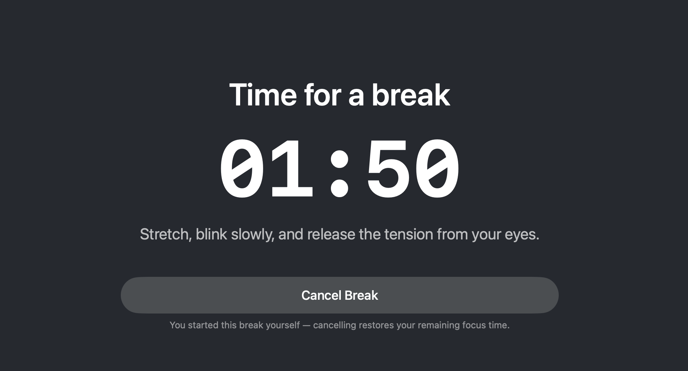
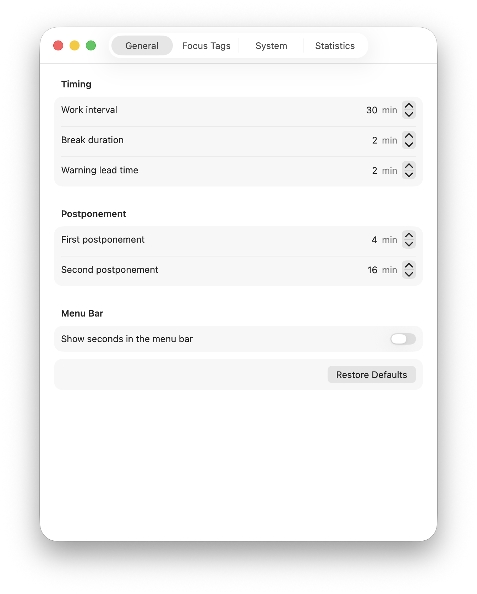

# BreakGuard User Guide

## First Launch

For a fresh installation, run the one-command setup from the
[README Quick Start](../README.md#quick-start). It downloads the source into `~/BreakGuard`, checks
the local Swift and macOS toolchain, builds and ad-hoc signs the app, installs it under
`~/Applications`, and launches it.

After BreakGuard starts:

1. Look for the eye-and-timer item in the menu bar.
2. Approve notification permission if you want advance warning banners.
3. Open **Settings** to review the default work interval, break duration, and warning lead time.
4. Enable **Launch at Login** only if you want BreakGuard to start automatically with macOS.

Notifications are optional. Declining permission does not affect the timer or break overlay.

## Menu and Break Actions

The menu bar displays an eye icon and the current timer. Its menu contains the current status, **Take a Break Now**, **Just Took a Break**, **Extend Focus**, **Pause Until 9 AM**, **Resume Now**, Settings, and Quit when those actions are available. In the last minute before a break, the countdown turns into a red badge with white text.

Actions that skip or silence rest — **Just Took a Break**, longer **Extend Focus** options, **Pause Until 9 AM**, and **Quit** — ask for confirmation first. The dialogs are deliberately direct: nothing is logged or punished, so the only person a false answer can cheat is you.

**Take a Break Now** starts a manual break. Its overlay shows only **Cancel Break**, which restores the remaining focus time without recording the overlay time. A scheduled break instead shows the configured postpone actions and cannot be cancelled.

<p align="center">
  
</p>

**Just Took a Break** records rest that BreakGuard could not observe, such as time away for coffee. After confirmation, it starts a fresh work cycle without changing focus statistics or streaks.

**Extend Focus** moves the current deadline by 15 minutes, 35 minutes, or 1 hour 5 minutes. Each menu option shows the resulting end time. Longer extensions require confirmation. Extended time counts as focus time but is not recorded as a postponement or streak violation.

**Pause Until 9 AM** silences all break reminders until the next 9:00 AM (today's if it has not passed yet, otherwise tomorrow's) — for ending the workday without quitting the app. While paused, the status line reads "Paused until 9:00 AM", and the pause survives sleep, quit, and relaunch. At 9 AM a fresh work cycle starts automatically. **Resume Now** ends the pause early; after a pause at least as long as a break it also starts a fresh cycle.

When the break countdown reaches zero, the completion screen shows total rest time counting upward. Complete the break with a focus tag, choose **Skip**, or use **Continue Working** when focus tags are disabled.

## Settings and Statistics

Settings contains four tabs:

<p align="center">
  
</p>

- **General** controls work and break timing, postponement durations, and whether menu-bar seconds are shown.
- **Focus Tags** enables classification after breaks and manages the tag catalog. `Work` and `Study` are provided by default.
- **System** controls notification sound, tests notification delivery, and manages launch at login.
- **Statistics** shows focused minutes by tag, skipped time, streaks, and break history, and includes a confirmed reset action.

Settings are saved immediately. **Restore Defaults** resets configuration without clearing statistics.

Completing a break with a tag credits that tag with actual focused minutes. Extended and postponed work counts; sleep and inactive time do not. An early break credits only elapsed work. **Skip** records the break and streak result but does not credit a tag. When focus-tag prompts are disabled, completed breaks still count but focus minutes are not recorded.

## Sleep, Quit, and Restart Behavior

A short interruption pauses the timer and resumes with the same remaining time. An interruption at least as long as the configured break duration counts as rest already taken and starts a fresh work cycle without recording statistics. This rule applies to sleep, logout, clean quit, and system restart.

If the app crashes, a sufficiently stale restored deadline also starts a fresh cycle. Shorter interruptions resume from their preserved state.

## Notifications

BreakGuard requests notification permission on first launch. The timer and break overlay continue to work when permission is denied, but warning banners are unavailable.

The System settings tab distinguishes overall permission from disabled alert styles and shows whether macOS allows regular or Time Sensitive delivery. The test action reports when a request is queued, confirms foreground delivery when observed, or reports that no delivery was observed.

The default app bundle is ad-hoc signed and therefore uses regular active notifications. True Time Sensitive delivery requires an eligible Apple provisioning profile, the `com.apple.developer.usernotifications.time-sensitive` entitlement, and the user's permission. The preview always uses regular active delivery so it can test basic presentation independently.

Notification delivery is ultimately controlled by macOS and is not guaranteed. Focus modes, notification preferences, alert style, and system scheduling can affect presentation.

## Launch at Login

BreakGuard uses `SMAppService.mainApp` for launch at login. macOS may require approval in System Settings. The System tab shows the current status and links to the relevant system settings when action is required.

## Data and Logs

Persisted state is stored at:

```text
~/Library/Application Support/BreakGuard/state.json
```

The file is schema-versioned. Compatible older data is migrated; incompatible or unversioned data is reset to safe defaults.

Inspect logs in Console.app by filtering for:

```text
subsystem:local.bohdan.BreakGuard
```

Or stream logs from Terminal:

```bash
log stream --predicate 'subsystem == "local.bohdan.BreakGuard"' --style compact
```

## Manual macOS Actions

Depending on the machine and selected features, macOS may require you to:

1. Install Apple Command Line Tools.
2. Approve notification permission.
3. Approve BreakGuard as a login item.

## Known macOS Limitations

The overlay is a best-effort blocking interface. macOS still permits Force Quit, process termination, logout, system-level navigation, and other actions outside a normal app's public APIs. Full-screen and Stage Manager behavior follows macOS window-management rules.
